# 训练平台架构图文档

## 1. 总体架构图

### 1.1 系统整体架构

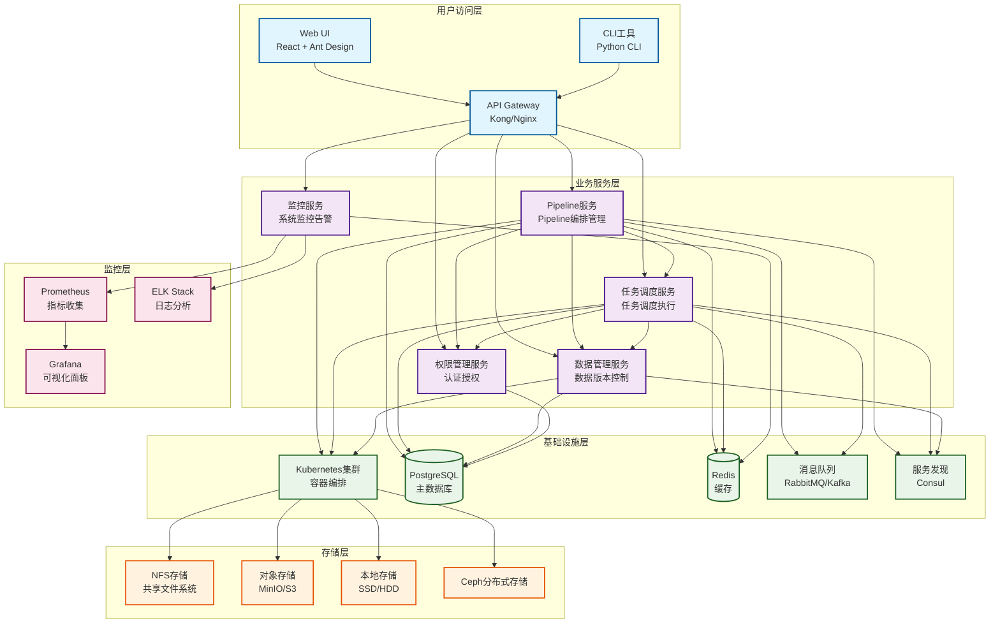
```mermaid
graph TB
    subgraph "用户访问层"
        UI[Web UI<br/>React + Ant Design]
        CLI[CLI工具<br/>Python CLI]
        API[API Gateway<br/>Kong/Nginx]
    end
    
    subgraph "业务服务层"
        PS[Pipeline服务<br/>Pipeline编排管理]
        TS[任务调度服务<br/>任务调度执行]
        DMS[数据管理服务<br/>数据版本控制]
        AMS[权限管理服务<br/>认证授权]
        MS[监控服务<br/>系统监控告警]
    end
    
    subgraph "基础设施层"
        K8s[Kubernetes集群<br/>容器编排]
        DB[(PostgreSQL<br/>主数据库)]
        Cache[(Redis<br/>缓存)]
        MQ[消息队列<br/>RabbitMQ/Kafka]
        Consul[服务发现<br/>Consul]
    end
    
    subgraph "存储层"
        NFS[NFS存储<br/>共享文件系统]
        S3[对象存储<br/>MinIO/S3]
        Local[本地存储<br/>SSD/HDD]
        Ceph[Ceph分布式存储]
    end
    
    subgraph "监控层"
        Prom[Prometheus<br/>指标收集]
        Grafana[Grafana<br/>可视化面板]
        ELK[ELK Stack<br/>日志分析]
    end
    
    %% 用户访问层连接
    UI --> API
    CLI --> API
    
    %% API网关到业务服务
    API --> PS
    API --> TS
    API --> DMS
    API --> AMS
    API --> MS
    
    %% 业务服务间通信
    PS --> TS
    PS --> DMS
    TS --> DMS
    PS --> AMS
    TS --> AMS
    
    %% 业务服务到基础设施
    PS --> K8s
    TS --> K8s
    DMS --> K8s
    
    PS --> DB
    TS --> DB
    DMS --> DB
    AMS --> DB
    
    PS --> Cache
    TS --> Cache
    MS --> Cache
    
    PS --> MQ
    TS --> MQ
    
    PS --> Consul
    TS --> Consul
    DMS --> Consul
    
    %% Kubernetes到存储
    K8s --> NFS
    K8s --> S3
    K8s --> Local
    K8s --> Ceph
    
    %% 监控连接
    MS --> Prom
    Prom --> Grafana
    MS --> ELK
    
    %% 样式定义
    classDef userLayer fill:#e1f5fe,stroke:#01579b,stroke-width:2px
    classDef serviceLayer fill:#f3e5f5,stroke:#4a148c,stroke-width:2px
    classDef infraLayer fill:#e8f5e8,stroke:#1b5e20,stroke-width:2px
    classDef storageLayer fill:#fff3e0,stroke:#e65100,stroke-width:2px
    classDef monitorLayer fill:#fce4ec,stroke:#880e4f,stroke-width:2px
    
    class UI,CLI,API userLayer
    class PS,TS,DMS,AMS,MS serviceLayer
    class K8s,DB,Cache,MQ,Consul infraLayer
    class NFS,S3,Local,Ceph storageLayer
    class Prom,Grafana,ELK monitorLayer
```

### 1.2 数据流向架构

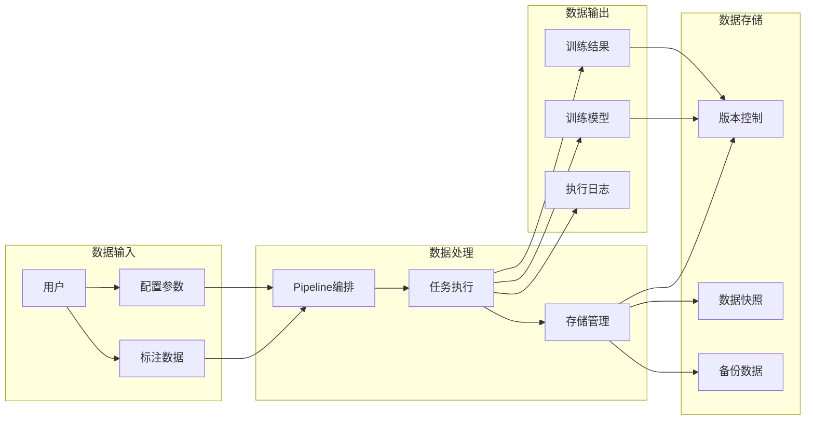
```mermaid
graph LR
    subgraph "数据输入"
        User[用户]
        Annotations[标注数据]
        Config[配置参数]
    end
    
    subgraph "数据处理"
        Pipeline[Pipeline编排]
        Task[任务执行]
        Storage[存储管理]
    end
    
    subgraph "数据输出"
        Model[训练模型]
        Results[训练结果]
        Logs[执行日志]
    end
    
    subgraph "数据存储"
        Version[版本控制]
        Snapshot[数据快照]
        Backup[备份数据]
    end
    
    User --> Annotations
    User --> Config
    
    Annotations --> Pipeline
    Config --> Pipeline
    
    Pipeline --> Task
    Task --> Storage
    
    Task --> Model
    Task --> Results
    Task --> Logs
    
    Storage --> Version
    Storage --> Snapshot
    Storage --> Backup
    
    Model --> Version
    Results --> Version
```

## 2. 核心功能时序图

### 2.1 Pipeline创建和执行时序图

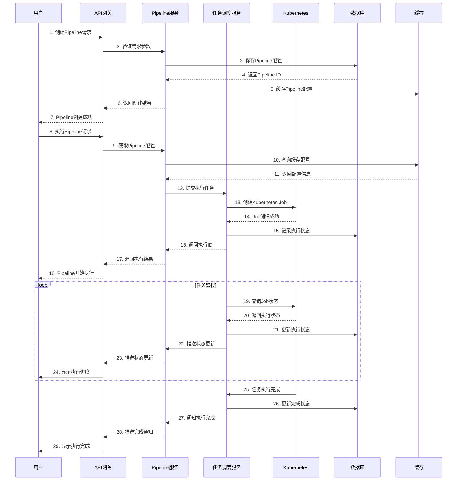
```mermaid
sequenceDiagram
    participant U as 用户
    participant API as API网关
    participant PS as Pipeline服务
    participant TS as 任务调度服务
    participant K8s as Kubernetes
    participant DB as 数据库
    participant Cache as 缓存

    U->>API: 1. 创建Pipeline请求
    API->>PS: 2. 验证请求参数
    PS->>DB: 3. 保存Pipeline配置
    DB-->>PS: 4. 返回Pipeline ID
    PS->>Cache: 5. 缓存Pipeline配置
    PS-->>API: 6. 返回创建结果
    API-->>U: 7. Pipeline创建成功

    U->>API: 8. 执行Pipeline请求
    API->>PS: 9. 获取Pipeline配置
    PS->>Cache: 10. 查询缓存配置
    Cache-->>PS: 11. 返回配置信息
    PS->>TS: 12. 提交执行任务
    TS->>K8s: 13. 创建Kubernetes Job
    K8s-->>TS: 14. Job创建成功
    TS->>DB: 15. 记录执行状态
    TS-->>PS: 16. 返回执行ID
    PS-->>API: 17. 返回执行结果
    API-->>U: 18. Pipeline开始执行

    loop 任务监控
        TS->>K8s: 19. 查询Job状态
        K8s-->>TS: 20. 返回执行状态
        TS->>DB: 21. 更新执行状态
        TS->>PS: 22. 推送状态更新
        PS->>API: 23. 推送状态更新
        API->>U: 24. 显示执行进度
    end

    K8s->>TS: 25. 任务执行完成
    TS->>DB: 26. 更新完成状态
    TS->>PS: 27. 通知执行完成
    PS->>API: 28. 推送完成通知
    API->>U: 29. 显示执行完成
```

### 2.2 增量学习完整流程时序图

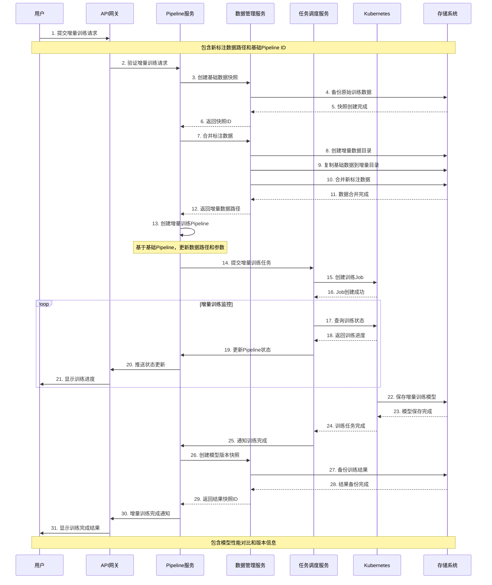
```mermaid
sequenceDiagram
    participant U as 用户
    participant API as API网关
    participant PS as Pipeline服务
    participant DMS as 数据管理服务
    participant TS as 任务调度服务
    participant K8s as Kubernetes
    participant Storage as 存储系统

    U->>API: 1. 提交增量训练请求
    Note over U,Storage: 包含新标注数据路径和基础Pipeline ID
    
    API->>PS: 2. 验证增量训练请求
    PS->>DMS: 3. 创建基础数据快照
    DMS->>Storage: 4. 备份原始训练数据
    Storage-->>DMS: 5. 快照创建完成
    DMS-->>PS: 6. 返回快照ID
    
    PS->>DMS: 7. 合并标注数据
    DMS->>Storage: 8. 创建增量数据目录
    DMS->>Storage: 9. 复制基础数据到增量目录
    DMS->>Storage: 10. 合并新标注数据
    Storage-->>DMS: 11. 数据合并完成
    DMS-->>PS: 12. 返回增量数据路径
    
    PS->>PS: 13. 创建增量训练Pipeline
    Note over PS: 基于基础Pipeline，更新数据路径和参数
    
    PS->>TS: 14. 提交增量训练任务
    TS->>K8s: 15. 创建训练Job
    K8s-->>TS: 16. Job创建成功
    
    loop 增量训练监控
        TS->>K8s: 17. 查询训练状态
        K8s-->>TS: 18. 返回训练进度
        TS->>PS: 19. 更新Pipeline状态
        PS->>API: 20. 推送状态更新
        API->>U: 21. 显示训练进度
    end
    
    K8s->>Storage: 22. 保存增量训练模型
    Storage-->>K8s: 23. 模型保存完成
    K8s-->>TS: 24. 训练任务完成
    TS->>PS: 25. 通知训练完成
    
    PS->>DMS: 26. 创建模型版本快照
    DMS->>Storage: 27. 备份训练结果
    Storage-->>DMS: 28. 结果备份完成
    DMS-->>PS: 29. 返回结果快照ID
    
    PS->>API: 30. 增量训练完成通知
    API->>U: 31. 显示训练完成结果
    Note over U,Storage: 包含模型性能对比和版本信息
```

### 2.3 存储挂载点管理时序图

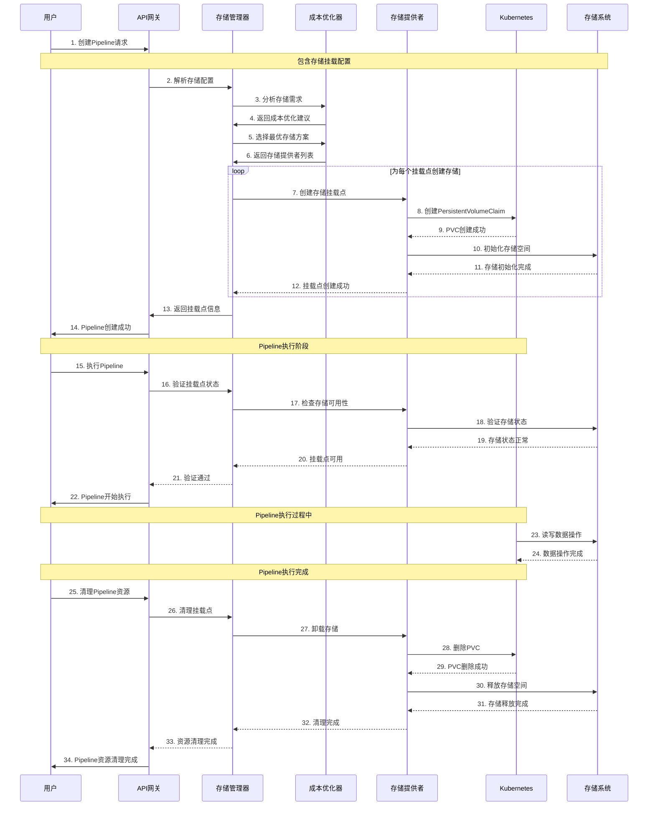
```mermaid
sequenceDiagram
    participant U as 用户
    participant API as API网关
    participant SM as 存储管理器
    participant CO as 成本优化器
    participant SP as 存储提供者
    participant K8s as Kubernetes
    participant Storage as 存储系统

    U->>API: 1. 创建Pipeline请求
    Note over U,Storage: 包含存储挂载配置
    
    API->>SM: 2. 解析存储配置
    SM->>CO: 3. 分析存储需求
    CO->>SM: 4. 返回成本优化建议
    
    SM->>CO: 5. 选择最优存储方案
    CO->>SM: 6. 返回存储提供者列表
    
    loop 为每个挂载点创建存储
        SM->>SP: 7. 创建存储挂载点
        SP->>K8s: 8. 创建PersistentVolumeClaim
        K8s-->>SP: 9. PVC创建成功
        SP->>Storage: 10. 初始化存储空间
        Storage-->>SP: 11. 存储初始化完成
        SP-->>SM: 12. 挂载点创建成功
    end
    
    SM->>API: 13. 返回挂载点信息
    API->>U: 14. Pipeline创建成功
    
    Note over U,K8s: Pipeline执行阶段
    
    U->>API: 15. 执行Pipeline
    API->>SM: 16. 验证挂载点状态
    SM->>SP: 17. 检查存储可用性
    SP->>Storage: 18. 验证存储状态
    Storage-->>SP: 19. 存储状态正常
    SP-->>SM: 20. 挂载点可用
    SM-->>API: 21. 验证通过
    API->>U: 22. Pipeline开始执行
    
    Note over U,K8s: Pipeline执行过程中
    
    K8s->>Storage: 23. 读写数据操作
    Storage-->>K8s: 24. 数据操作完成
    
    Note over U,K8s: Pipeline执行完成
    
    U->>API: 25. 清理Pipeline资源
    API->>SM: 26. 清理挂载点
    SM->>SP: 27. 卸载存储
    SP->>K8s: 28. 删除PVC
    K8s-->>SP: 29. PVC删除成功
    SP->>Storage: 30. 释放存储空间
    Storage-->>SP: 31. 存储释放完成
    SP-->>SM: 32. 清理完成
    SM-->>API: 33. 资源清理完成
    API->>U: 34. Pipeline资源清理完成
```

### 2.4 数据版本管理时序图

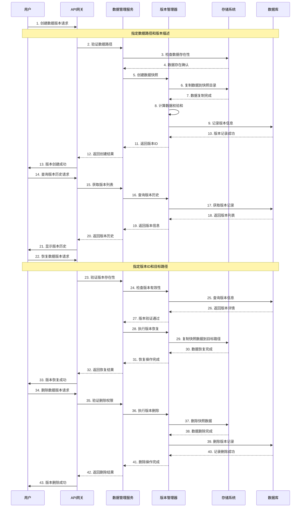
```mermaid
sequenceDiagram
    participant U as 用户
    participant API as API网关
    participant DMS as 数据管理服务
    participant VM as 版本管理器
    participant Storage as 存储系统
    participant DB as 数据库

    U->>API: 1. 创建数据版本请求
    Note over U,DB: 指定数据路径和版本描述
    
    API->>DMS: 2. 验证数据路径
    DMS->>Storage: 3. 检查数据存在性
    Storage-->>DMS: 4. 数据存在确认
    DMS->>VM: 5. 创建数据快照
    VM->>Storage: 6. 复制数据到快照目录
    Storage-->>VM: 7. 数据复制完成
    VM->>VM: 8. 计算数据校验和
    VM->>DB: 9. 记录版本信息
    DB-->>VM: 10. 版本记录成功
    VM-->>DMS: 11. 返回版本ID
    DMS-->>API: 12. 返回创建结果
    API->>U: 13. 版本创建成功

    U->>API: 14. 查询版本历史请求
    API->>DMS: 15. 获取版本列表
    DMS->>VM: 16. 查询版本历史
    VM->>DB: 17. 获取版本记录
    DB-->>VM: 18. 返回版本列表
    VM-->>DMS: 19. 返回版本信息
    DMS-->>API: 20. 返回版本历史
    API->>U: 21. 显示版本历史

    U->>API: 22. 恢复数据版本请求
    Note over U,DB: 指定版本ID和目标路径
    
    API->>DMS: 23. 验证版本存在性
    DMS->>VM: 24. 检查版本有效性
    VM->>DB: 25. 查询版本信息
    DB-->>VM: 26. 返回版本详情
    VM-->>DMS: 27. 版本验证通过
    DMS->>VM: 28. 执行版本恢复
    VM->>Storage: 29. 复制快照数据到目标路径
    Storage-->>VM: 30. 数据恢复完成
    VM-->>DMS: 31. 恢复操作完成
    DMS-->>API: 32. 返回恢复结果
    API->>U: 33. 版本恢复成功

    U->>API: 34. 删除数据版本请求
    API->>DMS: 35. 验证删除权限
    DMS->>VM: 36. 执行版本删除
    VM->>Storage: 37. 删除快照数据
    Storage-->>VM: 38. 数据删除完成
    VM->>DB: 39. 删除版本记录
    DB-->>VM: 40. 记录删除成功
    VM-->>DMS: 41. 删除操作完成
    DMS-->>API: 42. 返回删除结果
    API->>U: 43. 版本删除成功
```

### 2.5 任务调度和资源管理时序图

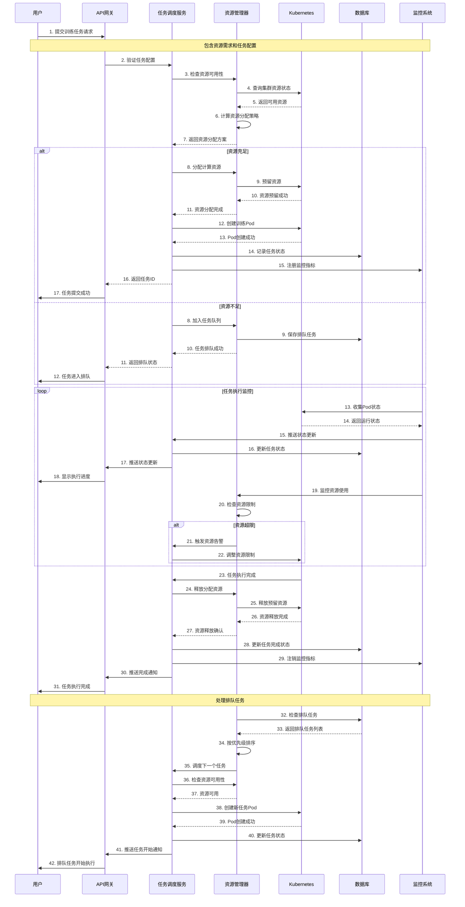
```mermaid
sequenceDiagram
    participant U as 用户
    participant API as API网关
    participant TS as 任务调度服务
    participant RM as 资源管理器
    participant K8s as Kubernetes
    participant DB as 数据库
    participant Monitor as 监控系统

    U->>API: 1. 提交训练任务请求
    Note over U,Monitor: 包含资源需求和任务配置
    
    API->>TS: 2. 验证任务配置
    TS->>RM: 3. 检查资源可用性
    RM->>K8s: 4. 查询集群资源状态
    K8s-->>RM: 5. 返回可用资源
    RM->>RM: 6. 计算资源分配策略
    RM-->>TS: 7. 返回资源分配方案
    
    alt 资源充足
        TS->>RM: 8. 分配计算资源
        RM->>K8s: 9. 预留资源
        K8s-->>RM: 10. 资源预留成功
        RM-->>TS: 11. 资源分配完成
        TS->>K8s: 12. 创建训练Pod
        K8s-->>TS: 13. Pod创建成功
        TS->>DB: 14. 记录任务状态
        TS->>Monitor: 15. 注册监控指标
        TS-->>API: 16. 返回任务ID
        API->>U: 17. 任务提交成功
    else 资源不足
        TS->>RM: 8. 加入任务队列
        RM->>DB: 9. 保存排队任务
        RM-->>TS: 10. 任务排队成功
        TS-->>API: 11. 返回排队状态
        API->>U: 12. 任务进入排队
    end
    
    loop 任务执行监控
        Monitor->>K8s: 13. 收集Pod状态
        K8s-->>Monitor: 14. 返回运行状态
        Monitor->>TS: 15. 推送状态更新
        TS->>DB: 16. 更新任务状态
        TS->>API: 17. 推送状态更新
        API->>U: 18. 显示执行进度
        
        Monitor->>RM: 19. 监控资源使用
        RM->>RM: 20. 检查资源限制
        alt 资源超限
            RM->>TS: 21. 触发资源告警
            TS->>K8s: 22. 调整资源限制
        end
    end
    
    K8s->>TS: 23. 任务执行完成
    TS->>RM: 24. 释放分配资源
    RM->>K8s: 25. 释放预留资源
    K8s-->>RM: 26. 资源释放完成
    RM-->>TS: 27. 资源释放确认
    TS->>DB: 28. 更新任务完成状态
    TS->>Monitor: 29. 注销监控指标
    TS->>API: 30. 推送完成通知
    API->>U: 31. 任务执行完成
    
    Note over U,Monitor: 处理排队任务
    
    RM->>DB: 32. 检查排队任务
    DB-->>RM: 33. 返回排队任务列表
    RM->>RM: 34. 按优先级排序
    RM->>TS: 35. 调度下一个任务
    TS->>RM: 36. 检查资源可用性
    RM-->>TS: 37. 资源可用
    TS->>K8s: 38. 创建新任务Pod
    K8s-->>TS: 39. Pod创建成功
    TS->>DB: 40. 更新任务状态
    TS->>API: 41. 推送任务开始通知
    API->>U: 42. 排队任务开始执行
```

### 2.6 权限认证和授权时序图

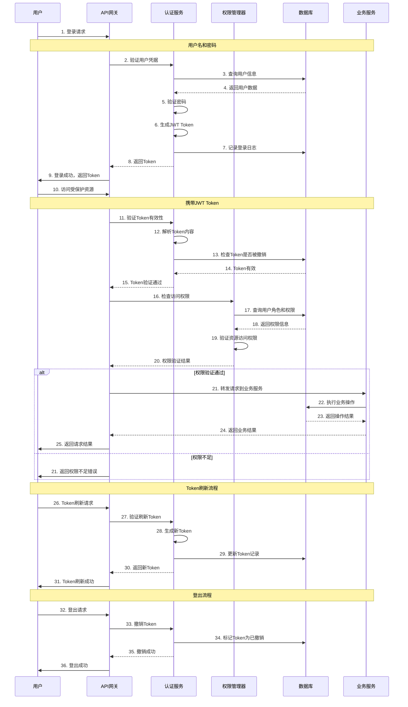
```mermaid
sequenceDiagram
    participant U as 用户
    participant API as API网关
    participant Auth as 认证服务
    participant RBAC as 权限管理器
    participant DB as 数据库
    participant Service as 业务服务

    U->>API: 1. 登录请求
    Note over U,Service: 用户名和密码
    
    API->>Auth: 2. 验证用户凭据
    Auth->>DB: 3. 查询用户信息
    DB-->>Auth: 4. 返回用户数据
    Auth->>Auth: 5. 验证密码
    Auth->>Auth: 6. 生成JWT Token
    Auth->>DB: 7. 记录登录日志
    Auth-->>API: 8. 返回Token
    API->>U: 9. 登录成功，返回Token

    U->>API: 10. 访问受保护资源
    Note over U,Service: 携带JWT Token
    
    API->>Auth: 11. 验证Token有效性
    Auth->>Auth: 12. 解析Token内容
    Auth->>DB: 13. 检查Token是否被撤销
    DB-->>Auth: 14. Token有效
    Auth-->>API: 15. Token验证通过
    
    API->>RBAC: 16. 检查访问权限
    RBAC->>DB: 17. 查询用户角色和权限
    DB-->>RBAC: 18. 返回权限信息
    RBAC->>RBAC: 19. 验证资源访问权限
    RBAC-->>API: 20. 权限验证结果
    
    alt 权限验证通过
        API->>Service: 21. 转发请求到业务服务
        Service->>DB: 22. 执行业务操作
        DB-->>Service: 23. 返回操作结果
        Service-->>API: 24. 返回业务结果
        API->>U: 25. 返回请求结果
    else 权限不足
        API->>U: 21. 返回权限不足错误
    end
    
    Note over U,Service: Token刷新流程
    
    U->>API: 26. Token刷新请求
    API->>Auth: 27. 验证刷新Token
    Auth->>Auth: 28. 生成新Token
    Auth->>DB: 29. 更新Token记录
    Auth-->>API: 30. 返回新Token
    API->>U: 31. Token刷新成功
    
    Note over U,Service: 登出流程
    
    U->>API: 32. 登出请求
    API->>Auth: 33. 撤销Token
    Auth->>DB: 34. 标记Token为已撤销
    Auth-->>API: 35. 撤销成功
    API->>U: 36. 登出成功
```

## 3. 数据流架构图

### 3.1 数据存储架构

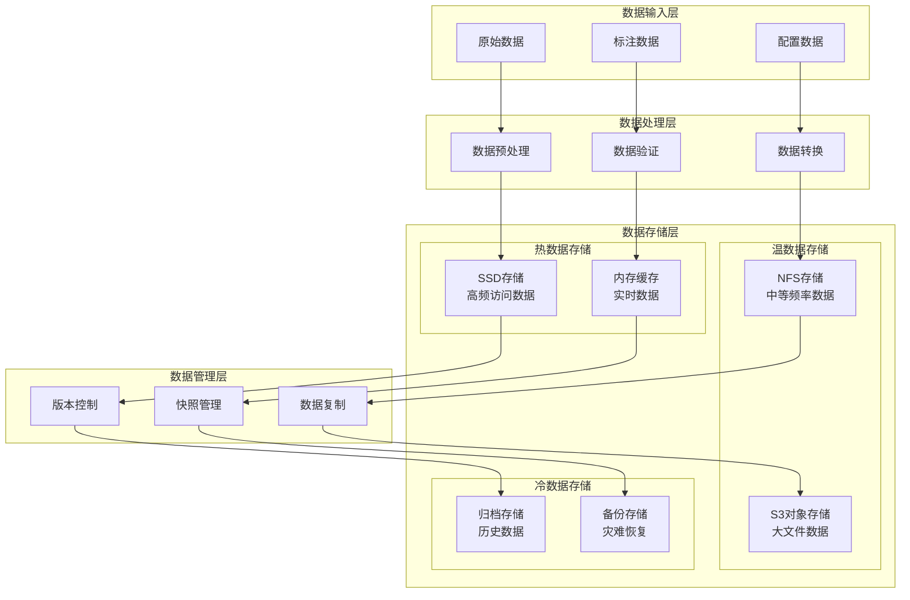
```mermaid
graph TB
    subgraph "数据输入层"
        RawData[原始数据]
        Annotations[标注数据]
        Config[配置数据]
    end
    
    subgraph "数据处理层"
        Preprocess[数据预处理]
        Validate[数据验证]
        Transform[数据转换]
    end
    
    subgraph "数据存储层"
        subgraph "热数据存储"
            SSD[SSD存储<br/>高频访问数据]
            Memory[内存缓存<br/>实时数据]
        end
        
        subgraph "温数据存储"
            NFS[NFS存储<br/>中等频率数据]
            S3[S3对象存储<br/>大文件数据]
        end
        
        subgraph "冷数据存储"
            Archive[归档存储<br/>历史数据]
            Backup[备份存储<br/>灾难恢复]
        end
    end
    
    subgraph "数据管理层"
        Version[版本控制]
        Snapshot[快照管理]
        Replication[数据复制]
    end
    
    RawData --> Preprocess
    Annotations --> Validate
    Config --> Transform
    
    Preprocess --> SSD
    Validate --> Memory
    Transform --> NFS
    
    SSD --> Version
    Memory --> Snapshot
    NFS --> Replication
    
    Version --> Archive
    Snapshot --> Backup
    Replication --> S3
```

### 3.2 系统组件交互图

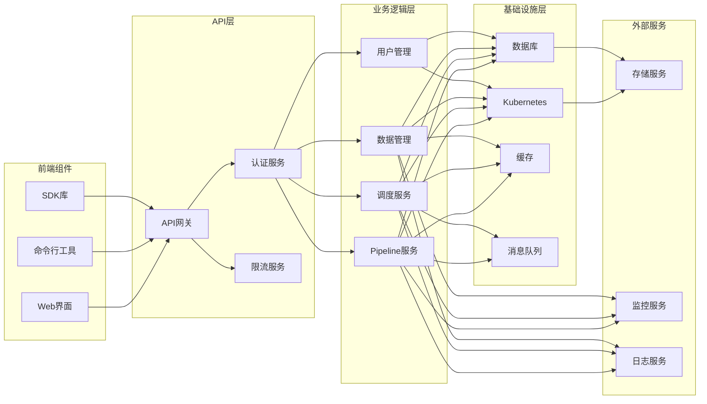
```mermaid
graph LR
    subgraph "前端组件"
        WebUI[Web界面]
        CLI[命令行工具]
        SDK[SDK库]
    end
    
    subgraph "API层"
        Gateway[API网关]
        Auth[认证服务]
        RateLimit[限流服务]
    end
    
    subgraph "业务逻辑层"
        Pipeline[Pipeline服务]
        Scheduler[调度服务]
        DataManager[数据管理]
        UserManager[用户管理]
    end
    
    subgraph "基础设施层"
        K8s[Kubernetes]
        DB[数据库]
        Cache[缓存]
        MQ[消息队列]
    end
    
    subgraph "外部服务"
        Storage[存储服务]
        Monitor[监控服务]
        Log[日志服务]
    end
    
    WebUI --> Gateway
    CLI --> Gateway
    SDK --> Gateway
    
    Gateway --> Auth
    Gateway --> RateLimit
    
    Auth --> Pipeline
    Auth --> Scheduler
    Auth --> DataManager
    Auth --> UserManager
    
    Pipeline --> K8s
    Scheduler --> K8s
    DataManager --> K8s
    UserManager --> K8s
    
    Pipeline --> DB
    Scheduler --> DB
    DataManager --> DB
    UserManager --> DB
    
    Pipeline --> Cache
    Scheduler --> Cache
    DataManager --> Cache
    
    Pipeline --> MQ
    Scheduler --> MQ
    
    K8s --> Storage
    DB --> Storage
    
    Pipeline --> Monitor
    Scheduler --> Monitor
    DataManager --> Monitor
    
    Pipeline --> Log
    Scheduler --> Log
    DataManager --> Log
```

## 4. 部署架构图

### 4.1 生产环境部署

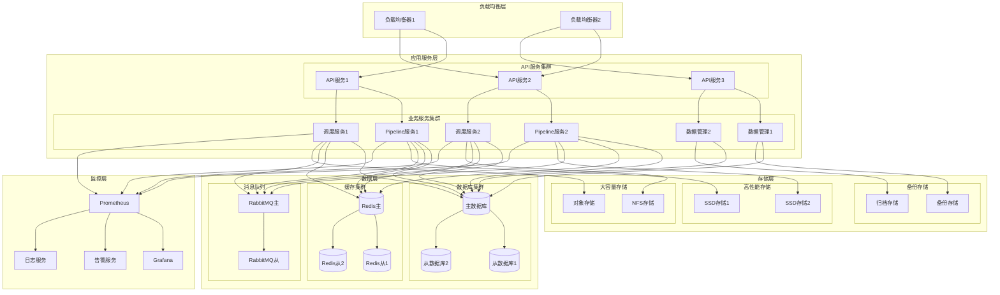
```mermaid
graph TB
    subgraph "负载均衡层"
        LB1[负载均衡器1]
        LB2[负载均衡器2]
    end
    
    subgraph "应用服务层"
        subgraph "API服务集群"
            API1[API服务1]
            API2[API服务2]
            API3[API服务3]
        end
        
        subgraph "业务服务集群"
            PS1[Pipeline服务1]
            PS2[Pipeline服务2]
            TS1[调度服务1]
            TS2[调度服务2]
            DMS1[数据管理1]
            DMS2[数据管理2]
        end
    end
    
    subgraph "数据层"
        subgraph "数据库集群"
            DB1[(主数据库)]
            DB2[(从数据库1)]
            DB3[(从数据库2)]
        end
        
        subgraph "缓存集群"
            Redis1[(Redis主)]
            Redis2[(Redis从1)]
            Redis3[(Redis从2)]
        end
        
        subgraph "消息队列"
            MQ1[RabbitMQ主]
            MQ2[RabbitMQ从]
        end
    end
    
    subgraph "存储层"
        subgraph "高性能存储"
            SSD1[SSD存储1]
            SSD2[SSD存储2]
        end
        
        subgraph "大容量存储"
            S3[对象存储]
            NFS[NFS存储]
        end
        
        subgraph "备份存储"
            Backup[备份存储]
            Archive[归档存储]
        end
    end
    
    subgraph "监控层"
        Prom[Prometheus]
        Grafana[Grafana]
        Alert[告警服务]
        Log[日志服务]
    end
    
    LB1 --> API1
    LB1 --> API2
    LB2 --> API2
    LB2 --> API3
    
    API1 --> PS1
    API1 --> TS1
    API2 --> PS2
    API2 --> TS2
    API3 --> DMS1
    API3 --> DMS2
    
    PS1 --> DB1
    PS2 --> DB1
    TS1 --> DB1
    TS2 --> DB1
    DMS1 --> DB1
    DMS2 --> DB1
    
    DB1 --> DB2
    DB1 --> DB3
    
    PS1 --> Redis1
    PS2 --> Redis1
    TS1 --> Redis1
    TS2 --> Redis1
    
    Redis1 --> Redis2
    Redis1 --> Redis3
    
    PS1 --> MQ1
    PS2 --> MQ1
    TS1 --> MQ1
    TS2 --> MQ1
    
    MQ1 --> MQ2
    
    PS1 --> SSD1
    PS2 --> SSD2
    TS1 --> S3
    TS2 --> NFS
    DMS1 --> Backup
    DMS2 --> Archive
    
    PS1 --> Prom
    PS2 --> Prom
    TS1 --> Prom
    TS2 --> Prom
    
    Prom --> Grafana
    Prom --> Alert
    Prom --> Log
```

这些架构图和时序图完整地展示了训练平台的系统架构、数据流向、组件交互和部署结构。每个时序图都详细描述了特定功能的执行流程，为后续的开发工作提供了清晰的指导。

## 5. 多用户并发训练解决方案

### 5.1 多用户并发训练时序图

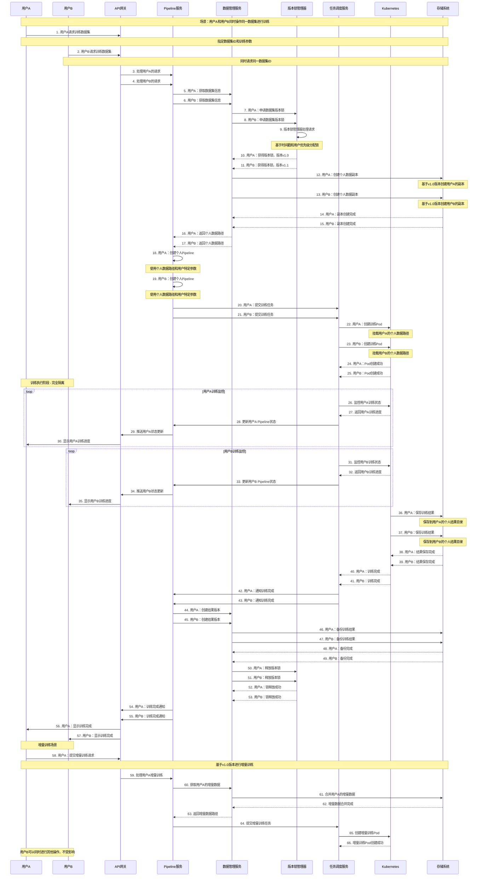
```mermaid
sequenceDiagram
    participant U1 as 用户A
    participant U2 as 用户B
    participant API as API网关
    participant PS as Pipeline服务
    participant DMS as 数据管理服务
    participant LOCK as 版本锁管理器
    participant TS as 任务调度服务
    participant K8s as Kubernetes
    participant Storage as 存储系统

    Note over U1,Storage: 场景：用户A和用户B同时操作同一数据集进行训练

    U1->>API: 1. 用户A请求训练数据集
    Note over U1,Storage: 指定数据集ID和训练参数
    
    U2->>API: 2. 用户B请求训练数据集
    Note over U2,Storage: 同时请求同一数据集ID
    
    API->>PS: 3. 处理用户A的请求
    API->>PS: 4. 处理用户B的请求
    
    PS->>DMS: 5. 用户A：获取数据集信息
    PS->>DMS: 6. 用户B：获取数据集信息
    
    DMS->>LOCK: 7. 用户A：申请数据集版本锁
    DMS->>LOCK: 8. 用户B：申请数据集版本锁
    
    LOCK->>LOCK: 9. 版本锁管理器处理请求
    Note over LOCK: 基于时间戳和用户优先级分配锁
    
    LOCK-->>DMS: 10. 用户A：获得版本锁，版本v1.0
    LOCK-->>DMS: 11. 用户B：获得版本锁，版本v1.1
    
    DMS->>Storage: 12. 用户A：创建个人数据副本
    Note over Storage: 基于v1.0版本创建用户A的副本
    DMS->>Storage: 13. 用户B：创建个人数据副本
    Note over Storage: 基于v1.0版本创建用户B的副本
    
    Storage-->>DMS: 14. 用户A：副本创建完成
    Storage-->>DMS: 15. 用户B：副本创建完成
    
    DMS-->>PS: 16. 用户A：返回个人数据路径
    DMS-->>PS: 17. 用户B：返回个人数据路径
    
    PS->>PS: 18. 用户A：创建个人Pipeline
    Note over PS: 使用个人数据路径和用户特定参数
    PS->>PS: 19. 用户B：创建个人Pipeline
    Note over PS: 使用个人数据路径和用户特定参数
    
    PS->>TS: 20. 用户A：提交训练任务
    PS->>TS: 21. 用户B：提交训练任务
    
    TS->>K8s: 22. 用户A：创建训练Pod
    Note over K8s: 挂载用户A的个人数据路径
    TS->>K8s: 23. 用户B：创建训练Pod
    Note over K8s: 挂载用户B的个人数据路径
    
    K8s-->>TS: 24. 用户A：Pod创建成功
    K8s-->>TS: 25. 用户B：Pod创建成功
    
    Note over U1,U2: 训练执行阶段 - 完全隔离
    
    loop 用户A训练监控
        TS->>K8s: 26. 监控用户A训练状态
        K8s-->>TS: 27. 返回用户A训练进度
        TS->>PS: 28. 更新用户A Pipeline状态
        PS->>API: 29. 推送用户A状态更新
        API->>U1: 30. 显示用户A训练进度
    end
    
    loop 用户B训练监控
        TS->>K8s: 31. 监控用户B训练状态
        K8s-->>TS: 32. 返回用户B训练进度
        TS->>PS: 33. 更新用户B Pipeline状态
        PS->>API: 34. 推送用户B状态更新
        API->>U2: 35. 显示用户B训练进度
    end
    
    K8s->>Storage: 36. 用户A：保存训练结果
    Note over Storage: 保存到用户A的个人结果目录
    K8s->>Storage: 37. 用户B：保存训练结果
    Note over Storage: 保存到用户B的个人结果目录
    
    Storage-->>K8s: 38. 用户A：结果保存完成
    Storage-->>K8s: 39. 用户B：结果保存完成
    
    K8s-->>TS: 40. 用户A：训练完成
    K8s-->>TS: 41. 用户B：训练完成
    
    TS->>PS: 42. 用户A：通知训练完成
    TS->>PS: 43. 用户B：通知训练完成
    
    PS->>DMS: 44. 用户A：创建结果版本
    PS->>DMS: 45. 用户B：创建结果版本
    
    DMS->>Storage: 46. 用户A：备份训练结果
    DMS->>Storage: 47. 用户B：备份训练结果
    
    Storage-->>DMS: 48. 用户A：备份完成
    Storage-->>DMS: 49. 用户B：备份完成
    
    DMS->>LOCK: 50. 用户A：释放版本锁
    DMS->>LOCK: 51. 用户B：释放版本锁
    
    LOCK-->>DMS: 52. 用户A：锁释放成功
    LOCK-->>DMS: 53. 用户B：锁释放成功
    
    PS->>API: 54. 用户A：训练完成通知
    PS->>API: 55. 用户B：训练完成通知
    
    API->>U1: 56. 用户A：显示训练完成
    API->>U2: 57. 用户B：显示训练完成
    
    Note over U1,U2: 增量训练场景
    
    U1->>API: 58. 用户A：提交增量训练请求
    Note over U1,Storage: 基于v1.0版本进行增量训练
    
    API->>PS: 59. 处理用户A增量训练
    PS->>DMS: 60. 获取用户A的增量数据
    DMS->>Storage: 61. 合并用户A的增量数据
    Storage-->>DMS: 62. 增量数据合并完成
    DMS-->>PS: 63. 返回增量数据路径
    PS->>TS: 64. 提交增量训练任务
    TS->>K8s: 65. 创建增量训练Pod
    K8s-->>TS: 66. 增量训练Pod创建成功
    
    Note over U1,U2: 用户B可以同时进行其他操作，不受影响
```

### 5.2 多用户数据隔离架构图

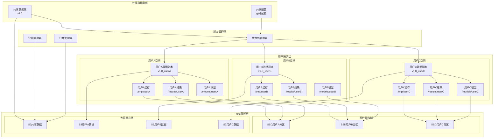
```mermaid
graph TB
    subgraph "共享数据集层"
        SharedData[共享数据集<br/>v1.0]
        SharedConfig[共享配置<br/>基础配置]
    end
    
    subgraph "用户隔离层"
        subgraph "用户A空间"
            UserA_Data[用户A数据副本<br/>v1.0_userA]
            UserA_Cache[用户A缓存<br/>/tmp/userA]
            UserA_Results[用户A结果<br/>/results/userA]
            UserA_Models[用户A模型<br/>/models/userA]
        end
        
        subgraph "用户B空间"
            UserB_Data[用户B数据副本<br/>v1.0_userB]
            UserB_Cache[用户B缓存<br/>/tmp/userB]
            UserB_Results[用户B结果<br/>/results/userB]
            UserB_Models[用户B模型<br/>/models/userB]
        end
        
        subgraph "用户C空间"
            UserC_Data[用户C数据副本<br/>v1.0_userC]
            UserC_Cache[用户C缓存<br/>/tmp/userC]
            UserC_Results[用户C结果<br/>/results/userC]
            UserC_Models[用户C模型<br/>/models/userC]
        end
    end
    
    subgraph "版本管理层"
        VersionLock[版本锁管理器]
        SnapshotMgr[快照管理器]
        MergeMgr[合并管理器]
    end
    
    subgraph "存储管理层"
        subgraph "高性能存储"
            SSD_UserA[SSD用户A分区]
            SSD_UserB[SSD用户B分区]
            SSD_UserC[SSD用户C分区]
        end
        
        subgraph "大容量存储"
            S3_Shared[S3共享数据]
            S3_UserA[S3用户A数据]
            S3_UserB[S3用户B数据]
            S3_UserC[S3用户C数据]
        end
    end
    
    SharedData --> VersionLock
    SharedConfig --> VersionLock
    
    VersionLock --> UserA_Data
    VersionLock --> UserB_Data
    VersionLock --> UserC_Data
    
    UserA_Data --> UserA_Cache
    UserA_Data --> UserA_Results
    UserA_Data --> UserA_Models
    
    UserB_Data --> UserB_Cache
    UserB_Data --> UserB_Results
    UserB_Models
    
    UserC_Data --> UserC_Cache
    UserC_Data --> UserC_Results
    UserC_Data --> UserC_Models
    
    UserA_Cache --> SSD_UserA
    UserA_Results --> SSD_UserA
    UserA_Models --> SSD_UserA
    
    UserB_Cache --> SSD_UserB
    UserB_Results --> SSD_UserB
    UserB_Models --> SSD_UserB
    
    UserC_Cache --> SSD_UserC
    UserC_Results --> SSD_UserC
    UserC_Models --> SSD_UserC
    
    SharedData --> S3_Shared
    UserA_Data --> S3_UserA
    UserB_Data --> S3_UserB
    UserC_Data --> S3_UserC
    
    SnapshotMgr --> S3_Shared
    MergeMgr --> S3_Shared
```

### 5.3 版本锁管理时序图

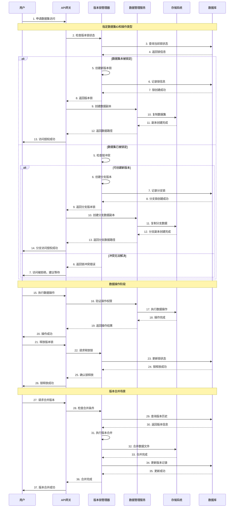
```mermaid
sequenceDiagram
    participant U as 用户
    participant API as API网关
    participant LOCK as 版本锁管理器
    participant DMS as 数据管理服务
    participant Storage as 存储系统
    participant DB as 数据库

    U->>API: 1. 申请数据集访问
    Note over U,DB: 指定数据集ID和操作类型
    
    API->>LOCK: 2. 检查版本锁状态
    LOCK->>DB: 3. 查询当前锁状态
    DB-->>LOCK: 4. 返回锁信息
    
    alt 数据集未被锁定
        LOCK->>LOCK: 5. 创建新版本锁
        LOCK->>DB: 6. 记录锁信息
        DB-->>LOCK: 7. 锁创建成功
        LOCK-->>API: 8. 返回版本锁
        API->>DMS: 9. 创建数据副本
        DMS->>Storage: 10. 复制数据集
        Storage-->>DMS: 11. 副本创建完成
        DMS-->>API: 12. 返回数据路径
        API->>U: 13. 访问授权成功
    else 数据集已被锁定
        LOCK->>LOCK: 5. 检查锁冲突
        alt 可创建新版本
            LOCK->>LOCK: 6. 创建分支版本
            LOCK->>DB: 7. 记录分支锁
            DB-->>LOCK: 8. 分支锁创建成功
            LOCK-->>API: 9. 返回分支版本锁
            API->>DMS: 10. 创建分支数据副本
            DMS->>Storage: 11. 复制分支数据
            Storage-->>DMS: 12. 分支副本创建完成
            DMS-->>API: 13. 返回分支数据路径
            API->>U: 14. 分支访问授权成功
        else 冲突无法解决
            LOCK-->>API: 6. 返回锁冲突错误
            API->>U: 7. 访问被拒绝，建议等待
        end
    end
    
    Note over U,DB: 数据操作阶段
    
    U->>API: 15. 执行数据操作
    API->>DMS: 16. 验证操作权限
    DMS->>Storage: 17. 执行数据操作
    Storage-->>DMS: 18. 操作完成
    DMS-->>API: 19. 返回操作结果
    API->>U: 20. 操作成功
    
    U->>API: 21. 释放版本锁
    API->>LOCK: 22. 请求释放锁
    LOCK->>DB: 23. 更新锁状态
    DB-->>LOCK: 24. 锁释放成功
    LOCK-->>API: 25. 确认锁释放
    API->>U: 26. 锁释放成功
    
    Note over U,DB: 版本合并场景
    
    U->>API: 27. 请求合并版本
    API->>LOCK: 28. 检查合并条件
    LOCK->>DB: 29. 查询版本历史
    DB-->>LOCK: 30. 返回版本信息
    LOCK->>LOCK: 31. 执行版本合并
    LOCK->>Storage: 32. 合并数据文件
    Storage-->>LOCK: 33. 合并完成
    LOCK->>DB: 34. 更新版本记录
    DB-->>LOCK: 35. 更新成功
    LOCK-->>API: 36. 合并完成
    API->>U: 37. 版本合并成功
```

### 5.4 多用户缓存隔离策略

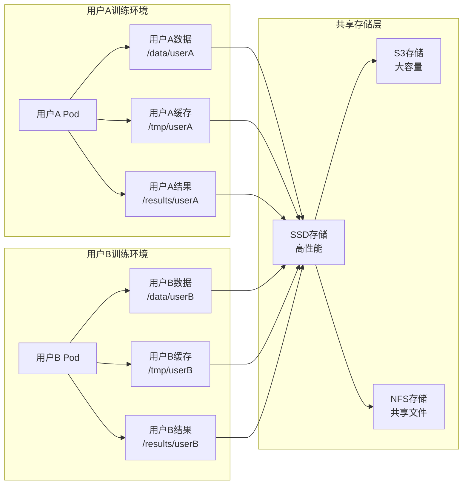
```mermaid
graph LR
    subgraph "用户A训练环境"
        A_Pod[用户A Pod]
        A_Data[用户A数据<br/>/data/userA]
        A_Cache[用户A缓存<br/>/tmp/userA]
        A_Results[用户A结果<br/>/results/userA]
    end
    
    subgraph "用户B训练环境"
        B_Pod[用户B Pod]
        B_Data[用户B数据<br/>/data/userB]
        B_Cache[用户B缓存<br/>/tmp/userB]
        B_Results[用户B结果<br/>/results/userB]
    end
    
    subgraph "共享存储层"
        Shared_SSD[SSD存储<br/>高性能]
        Shared_S3[S3存储<br/>大容量]
        Shared_NFS[NFS存储<br/>共享文件]
    end
    
    A_Pod --> A_Data
    A_Pod --> A_Cache
    A_Pod --> A_Results
    
    B_Pod --> B_Data
    B_Pod --> B_Cache
    B_Pod --> B_Results
    
    A_Data --> Shared_SSD
    A_Cache --> Shared_SSD
    A_Results --> Shared_SSD
    
    B_Data --> Shared_SSD
    B_Cache --> Shared_SSD
    B_Results --> Shared_SSD
    
    Shared_SSD --> Shared_S3
    Shared_SSD --> Shared_NFS
```

## 6. 多用户并发训练详细流程

### 6.1 核心解决策略

#### 1. **写时复制 (Copy-on-Write)**
- 当用户请求访问共享数据集时，系统自动创建个人副本
- 每个用户获得独立的数据版本，避免写冲突
- 基于时间戳和用户ID生成唯一版本号

#### 2. **用户空间隔离**
- 每个用户获得独立的命名空间：`/data/{username}/`
- 缓存目录隔离：`/tmp/{username}/`
- 结果目录隔离：`/results/{username}/`
- 模型目录隔离：`/models/{username}/`

#### 3. **版本锁管理**
- 实现乐观锁机制，支持并发读取
- 写操作时创建新版本，避免阻塞
- 版本合并策略：基于时间戳和冲突检测

#### 4. **存储分层策略**
- **热数据**：用户个人数据副本存储在SSD
- **温数据**：共享数据集存储在S3
- **冷数据**：历史版本存储在归档存储

### 6.2 挂载点配置示例

```yaml
# 用户A的训练Pod挂载配置
apiVersion: v1
kind: Pod
metadata:
  name: training-pod-userA
spec:
  containers:
  - name: training-container
    image: train-platform/training:latest
    volumeMounts:
    - name: user-data
      mountPath: /data/userA
    - name: user-cache
      mountPath: /tmp/userA
    - name: user-results
      mountPath: /results/userA
    - name: user-models
      mountPath: /models/userA
  volumes:
  - name: user-data
    persistentVolumeClaim:
      claimName: pvc-userA-data
  - name: user-cache
    emptyDir: {}
  - name: user-results
    persistentVolumeClaim:
      claimName: pvc-userA-results
  - name: user-models
    persistentVolumeClaim:
      claimName: pvc-userA-models
```

### 6.3 版本管理策略

#### 版本命名规则
```
数据集版本格式：{dataset_name}_v{major}.{minor}_{user_id}_{timestamp}
示例：
- 共享版本：imagenet_v1.0
- 用户A版本：imagenet_v1.0_userA_20231201120000
- 用户B版本：imagenet_v1.0_userB_20231201120030
```

#### 版本合并策略
1. **自动合并**：当用户完成训练后，系统自动检测是否可以合并
2. **手动合并**：用户可以选择合并到主版本
3. **冲突检测**：系统检测数据冲突并提供解决建议

### 6.4 性能优化策略

#### 1. **智能缓存**
- 用户个人缓存使用内存或SSD
- 共享数据缓存使用分布式缓存
- 缓存预热：预测用户可能访问的数据

#### 2. **存储优化**
- 数据去重：相同数据只存储一份
- 压缩存储：大文件自动压缩
- 分层存储：根据访问频率自动迁移

#### 3. **并发控制**
- 读写分离：支持多用户同时读取
- 写时复制：写操作不阻塞读操作
- 队列管理：高并发时自动排队

这个解决方案确保了多用户同时操作同一数据集时不会产生冲突，每个用户都有独立的工作空间，同时保持了数据的版本控制和一致性。

## 7. 增量学习完整流程时序图

### 7.1 增量学习闭环流程时序图

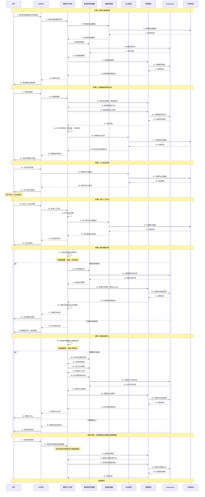
```mermaid
sequenceDiagram
    participant U as 用户
    participant API as API网关
    participant ILS as 增量学习系统
    participant BM as 基础模型管理器
    participant DM as 数据管理器
    participant AS as 标注服务
    participant DS as 部署服务
    participant K8s as Kubernetes
    participant Storage as 存储系统

    Note over U,Storage: 步骤1: 初始化基础模型
    
    U->>API: 1. 提交原始数据集和训练配置
    API->>ILS: 2. 初始化基础模型训练
    ILS->>DM: 3. 预处理原始数据集
    DM->>Storage: 4. 存储预处理数据
    Storage-->>DM: 5. 预处理完成
    DM-->>ILS: 6. 返回预处理数据
    ILS->>BM: 7. 训练基础模型
    BM->>K8s: 8. 创建训练任务
    K8s-->>BM: 9. 训练完成
    BM-->>ILS: 10. 返回基础模型
    ILS->>DS: 11. 部署基础模型
    DS->>K8s: 12. 部署模型服务
    K8s-->>DS: 13. 部署完成
    DS-->>ILS: 14. 基础模型部署成功
    ILS-->>API: 15. 初始化完成
    API->>U: 16. 基础模型准备就绪

    Note over U,Storage: 步骤2-3: 新数据处理和预测
    
    U->>API: 17. 提交新数据
    API->>ILS: 18. 处理新数据
    ILS->>DS: 19. 获取当前模型（基础模型）
    DS-->>ILS: 20. 返回模型客户端
    ILS->>DS: 21. 使用模型进行预测
    DS->>K8s: 22. 调用模型预测API
    K8s-->>DS: 23. 返回预测结果
    DS-->>ILS: 24. 预测完成
    ILS->>ILS: 25. 评价预测结果（置信度、不确定性）
    ILS->>AS: 26. 创建待标注任务
    AS->>Storage: 27. 存储待标注数据
    Storage-->>AS: 28. 存储完成
    AS-->>ILS: 29. 待标注任务创建成功
    ILS-->>API: 30. 新数据处理完成
    API->>U: 31. 待标注数据已准备

    Note over U,Storage: 步骤4: 人工标注界面
    
    U->>API: 32. 访问标注界面
    API->>AS: 33. 获取待标注数据
    AS->>Storage: 34. 读取待标注数据
    Storage-->>AS: 35. 返回数据
    AS-->>API: 36. 返回待标注列表
    API->>U: 37. 显示待标注数据
    Note over U: 用户进行人工标注确认

    Note over U,Storage: 步骤5: 提交人工标注
    
    U->>API: 38. 提交人工标注结果
    API->>ILS: 39. 处理人工标注
    ILS->>ILS: 40. 验证标注质量
    ILS->>DM: 41. 存入确认标记数据池
    DM->>Storage: 42. 存储确认数据
    Storage-->>DM: 43. 存储完成
    DM-->>ILS: 44. 确认数据存储成功
    ILS-->>API: 45. 标注提交成功
    API->>U: 46. 标注已确认

    Note over U,Storage: 步骤6: 触发增量训练
    
    ILS->>ILS: 47. 检查是否触发训练条件
    Note over ILS: 检查数据量、质量、时间间隔
    
    alt 满足训练条件
        ILS->>BM: 48. 执行增量训练
        BM->>K8s: 49. 创建增量训练任务
        K8s-->>BM: 50. 增量训练完成
        BM-->>ILS: 51. 返回实时模型
        ILS->>DS: 52. 部署实时模型（类似Ollama）
        DS->>K8s: 53. 部署实时模型服务
        K8s-->>DS: 54. 部署完成
        DS-->>ILS: 55. 实时模型部署成功
        ILS->>ILS: 56. 更新当前模型为实时模型
        ILS-->>API: 57. 增量训练完成
        API->>U: 58. 实时模型已更新
    else 不满足训练条件
        ILS-->>API: 48. 暂不触发训练
        API->>U: 49. 数据量不足，继续收集
    end

    Note over U,Storage: 步骤7: 模型结构优化
    
    ILS->>ILS: 59. 检查是否需要优化模型结构
    Note over ILS: 检查数据量、性能下降情况
    
    alt 需要优化结构
        ILS->>BM: 60. 分析当前模型性能
        BM-->>ILS: 61. 返回性能指标
        ILS->>BM: 62. 设计优化策略
        BM-->>ILS: 63. 返回优化计划
        ILS->>BM: 64. 执行模型结构优化
        BM->>K8s: 65. 创建优化训练任务
        K8s-->>BM: 66. 优化训练完成
        BM-->>ILS: 67. 返回优化后模型
        ILS->>DS: 68. 部署优化后模型
        DS->>K8s: 69. 部署优化模型服务
        K8s-->>DS: 70. 部署完成
        DS-->>ILS: 71. 优化模型部署成功
        ILS-->>API: 72. 模型优化完成
        API->>U: 73. 模型已优化
    else 不需要优化
        ILS-->>API: 60. 模型结构无需优化
        API->>U: 61. 模型性能良好
    end

    Note over U,Storage: 回到步骤2，使用更新后的模型处理新数据
    
    U->>API: 74. 提交新的数据
    API->>ILS: 75. 使用实时模型处理新数据
    Note over ILS: 现在使用实时模型而不是基础模型
    ILS->>DS: 76. 获取实时模型
    DS-->>ILS: 77. 返回实时模型客户端
    ILS->>DS: 78. 使用实时模型预测
    DS->>K8s: 79. 调用实时模型API
    K8s-->>DS: 80. 返回预测结果
    DS-->>ILS: 81. 预测完成
    Note over U,Storage: 继续循环...
```

### 7.2 人工标注界面流程时序图

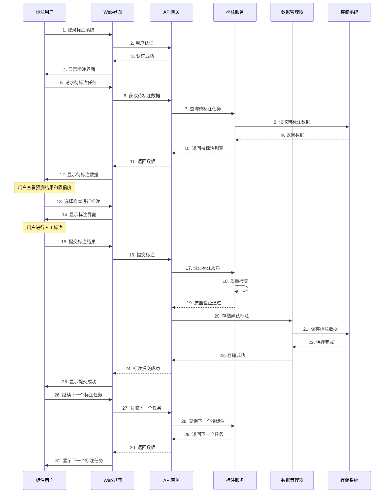
```mermaid
sequenceDiagram
    participant U as 标注用户
    participant Web as Web界面
    participant API as API网关
    participant AS as 标注服务
    participant DM as 数据管理器
    participant Storage as 存储系统

    U->>Web: 1. 登录标注系统
    Web->>API: 2. 用户认证
    API-->>Web: 3. 认证成功
    Web->>U: 4. 显示标注界面

    U->>Web: 5. 请求待标注任务
    Web->>API: 6. 获取待标注数据
    API->>AS: 7. 查询待标注任务
    AS->>Storage: 8. 读取待标注数据
    Storage-->>AS: 9. 返回数据
    AS-->>API: 10. 返回待标注列表
    API-->>Web: 11. 返回数据
    Web->>U: 12. 显示待标注数据

    Note over U: 用户查看预测结果和置信度

    U->>Web: 13. 选择样本进行标注
    Web->>U: 14. 显示标注界面
    Note over U: 用户进行人工标注

    U->>Web: 15. 提交标注结果
    Web->>API: 16. 提交标注
    API->>AS: 17. 验证标注质量
    AS->>AS: 18. 质量检查
    AS-->>API: 19. 质量验证通过
    API->>DM: 20. 存储确认标注
    DM->>Storage: 21. 保存标注数据
    Storage-->>DM: 22. 保存完成
    DM-->>API: 23. 存储成功
    API-->>Web: 24. 标注提交成功
    Web->>U: 25. 显示提交成功

    U->>Web: 26. 继续下一个标注任务
    Web->>API: 27. 获取下一个任务
    API->>AS: 28. 查询下一个待标注
    AS-->>API: 29. 返回下一个任务
    API-->>Web: 30. 返回数据
    Web->>U: 31. 显示下一个标注任务
```

### 7.3 模型部署服务架构图

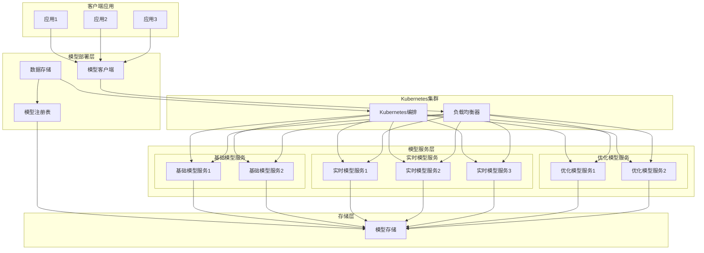
```mermaid
graph TB
    subgraph "模型部署层"
        DS[部署服务]
        MR[模型注册表]
        MC[模型客户端]
    end
    
    subgraph "模型服务层"
        subgraph "基础模型服务"
            BMS1[基础模型服务1]
            BMS2[基础模型服务2]
        end
        
        subgraph "实时模型服务"
            RMS1[实时模型服务1]
            RMS2[实时模型服务2]
            RMS3[实时模型服务3]
        end
        
        subgraph "优化模型服务"
            OMS1[优化模型服务1]
            OMS2[优化模型服务2]
        end
    end
    
    subgraph "Kubernetes集群"
        K8s[Kubernetes编排]
        LB[负载均衡器]
    end
    
    subgraph "存储层"
        MS[模型存储]
        DS[数据存储]
    end
    
    subgraph "客户端应用"
        App1[应用1]
        App2[应用2]
        App3[应用3]
    end
    
    DS --> MR
    DS --> K8s
    MR --> MS
    
    K8s --> BMS1
    K8s --> BMS2
    K8s --> RMS1
    K8s --> RMS2
    K8s --> RMS3
    K8s --> OMS1
    K8s --> OMS2
    
    LB --> BMS1
    LB --> BMS2
    LB --> RMS1
    LB --> RMS2
    LB --> RMS3
    LB --> OMS1
    LB --> OMS2
    
    BMS1 --> MS
    BMS2 --> MS
    RMS1 --> MS
    RMS2 --> MS
    RMS3 --> MS
    OMS1 --> MS
    OMS2 --> MS
    
    App1 --> MC
    App2 --> MC
    App3 --> MC
    
    MC --> LB
```

这个增量学习系统完整实现了你描述的7步流程，包括：

1. **基础模型初始化**：原始数据集训练基础模型
2. **新数据处理**：使用当前模型预测和评价
3. **智能抽样**：基于置信度和不确定性选择标注样本
4. **人工标注界面**：Web界面展示待标注数据
5. **标注确认**：人工确认后存入确认数据池
6. **增量训练**：基于确认数据训练实时模型
7. **模型优化**：根据数据量优化模型结构
8. **循环迭代**：使用更新后的模型继续处理新数据

系统支持类似Ollama的模型部署方式，提供高可用的模型服务，确保增量学习的连续性和稳定性。 