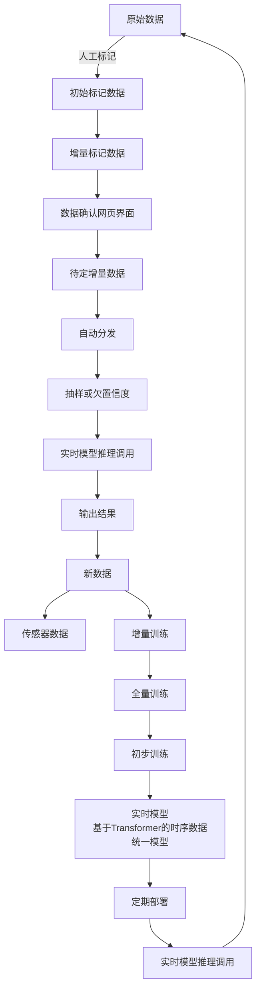

# 训练存储工作流平台详细设计文档

## 1. 系统概述

### 1.1 项目目标
构建一个独立的训练平台，支持Pipeline编排、增量学习、多挂载点管理和多用户并发训练，不依赖Cube-Studio。

### 1.2 核心特性
- **Pipeline编排**：支持复杂的训练流程编排和DAG管理
- **增量学习**：基于Transformer的时序数据统一模型，支持连续增量训练
- **多挂载点管理**：支持多种存储类型和动态挂载
- **多用户并发**：支持多用户同时操作同一数据集
- **实时推理**：支持模型实时推理调用和部署

## 2. 系统架构设计

### 2.1 整体架构
```
┌─────────────────────────────────────────────────────────────┐
│                    用户界面层                                │
├─────────────────────────────────────────────────────────────┤
│  Web UI  │  API Gateway  │  CLI Client  │  SDK Library     │
├─────────────────────────────────────────────────────────────┤
│                    业务逻辑层                                │
├─────────────────────────────────────────────────────────────┤
│ Pipeline │  任务调度  │  数据管理  │  模型管理  │  权限管理  │
│  编排服务 │   服务    │   服务    │   服务    │   服务    │
├─────────────────────────────────────────────────────────────┤
│                    数据存储层                                │
├─────────────────────────────────────────────────────────────┤
│ PostgreSQL │  Redis  │  MinIO  │  NFS  │  本地存储  │  GPU存储 │
├─────────────────────────────────────────────────────────────┤
│                    基础设施层                                │
├─────────────────────────────────────────────────────────────┤
│  Kubernetes  │  Docker  │  监控系统  │  日志系统  │  安全系统 │
└─────────────────────────────────────────────────────────────┘
```

### 2.2 核心服务设计

#### 2.2.1 Pipeline编排服务
- **Pipeline定义管理**：支持YAML/JSON格式的Pipeline配置
- **DAG解析引擎**：基于有向无环图的任务依赖关系管理
- **版本控制**：Pipeline版本管理和回滚机制
- **参数管理**：全局参数和变量管理

#### 2.2.2 任务调度服务
- **资源调度**：CPU、GPU、内存的细粒度资源配置
- **任务编排**：基于优先级的任务调度策略
- **状态监控**：实时监控任务执行状态
- **容错机制**：任务失败自动重试和恢复

#### 2.2.3 数据管理服务
- **存储抽象**：统一存储接口，支持多种存储类型
- **版本控制**：Git-like的数据版本控制
- **数据副本**：自动数据快照和副本管理
- **权限控制**：数据访问权限和审计

#### 2.2.4 模型管理服务
- **模型版本管理**：模型版本化和回滚机制
- **模型部署**：支持实时推理和批量推理
- **模型监控**：模型性能监控和告警
- **A/B测试**：模型对比测试和评估

## 3. 增量学习系统设计

### 3.1 增量学习完整流程

基于您提供的流程图，我们设计了完整的增量学习闭环：



### 3.2 Transformer时序数据统一模型设计

#### 3.2.1 模型架构
```python
class TransformerTimeSeriesModel(nn.Module):
    """
    基于Transformer的时序数据统一模型
    支持多模态时序数据输入和增量学习
    """
    def __init__(self, config):
        super().__init__()
        self.config = config
        
        # 多模态输入编码器
        self.input_encoders = nn.ModuleDict({
            'sensor': SensorEncoder(config.sensor_dim),
            'text': TextEncoder(config.text_dim),
            'image': ImageEncoder(config.image_dim),
            'audio': AudioEncoder(config.audio_dim)
        })
        
        # Transformer核心
        self.transformer = nn.TransformerEncoder(
            nn.TransformerEncoderLayer(
                d_model=config.hidden_size,
                nhead=config.num_heads,
                dim_feedforward=config.ffn_size,
                dropout=config.dropout
            ),
            num_layers=config.num_layers
        )
        
        # 时序建模组件
        self.temporal_encoder = TemporalEncoder(config)
        
        # 输出头
        self.output_heads = nn.ModuleDict({
            'classification': ClassificationHead(config),
            'regression': RegressionHead(config),
            'forecasting': ForecastingHead(config),
            'anomaly_detection': AnomalyDetectionHead(config)
        })
        
        # 增量学习组件
        self.incremental_learner = IncrementalLearner(config)
    
    def forward(self, inputs, task_type='classification'):
        # 多模态特征提取
        features = {}
        for modality, data in inputs.items():
            if modality in self.input_encoders:
                features[modality] = self.input_encoders[modality](data)
        
        # 特征融合
        fused_features = self.fuse_features(features)
        
        # 时序建模
        temporal_features = self.temporal_encoder(fused_features)
        
        # Transformer编码
        transformer_output = self.transformer(temporal_features)
        
        # 任务特定输出
        output = self.output_heads[task_type](transformer_output)
        
        return output
    
    def incremental_update(self, new_data, task_type='classification'):
        """
        增量学习更新
        """
        return self.incremental_learner.update(self, new_data, task_type)
```

#### 3.2.2 增量学习算法
```python
class IncrementalLearner:
    """
    增量学习算法实现
    支持知识蒸馏、弹性权重巩固、回放等策略
    """
    def __init__(self, config):
        self.config = config
        self.memory_bank = MemoryBank(config.memory_size)
        self.knowledge_distiller = KnowledgeDistiller(config)
        self.ewc = ElasticWeightConsolidation(config)
        
    def update(self, model, new_data, task_type):
        """
        增量学习更新流程
        """
        # 1. 数据预处理和质量检查
        processed_data = self.preprocess_data(new_data)
        
        # 2. 智能抽样策略
        sampled_data = self.intelligent_sampling(processed_data)
        
        # 3. 知识蒸馏（防止灾难性遗忘）
        distillation_loss = self.knowledge_distiller.compute_loss(
            model, sampled_data
        )
        
        # 4. 弹性权重巩固
        ewc_loss = self.ewc.compute_loss(model)
        
        # 5. 增量训练
        total_loss = distillation_loss + ewc_loss
        self.train_step(model, sampled_data, total_loss)
        
        # 6. 更新记忆库
        self.memory_bank.update(sampled_data)
        
        return model
```

### 3.3 数据流程设计

#### 3.3.1 数据标注流程
```python
class DataAnnotationService:
    """
    数据标注服务
    支持人工标注、自动标注、质量检查
    """
    def __init__(self):
        self.annotation_interface = AnnotationInterface()
        self.quality_checker = QualityChecker()
        self.data_validator = DataValidator()
    
    def process_new_annotations(self, raw_data):
        """
        处理新标注数据
        """
        # 1. 数据验证
        validated_data = self.data_validator.validate(raw_data)
        
        # 2. 质量检查
        quality_score = self.quality_checker.check(validated_data)
        
        # 3. 自动标注（可选）
        if self.config.auto_annotation:
            auto_annotated = self.auto_annotate(validated_data)
        else:
            auto_annotated = validated_data
        
        # 4. 人工确认
        confirmed_data = self.annotation_interface.confirm(auto_annotated)
        
        return confirmed_data
```

#### 3.3.2 数据分发和抽样
```python
class DataDistributionService:
    """
    数据分发和抽样服务
    支持智能抽样和欠置信度采样
    """
    def __init__(self):
        self.sampling_strategy = SamplingStrategy()
        self.confidence_estimator = ConfidenceEstimator()
    
    def distribute_data(self, data, strategy='intelligent'):
        """
        数据分发
        """
        if strategy == 'intelligent':
            # 智能抽样
            sampled_data = self.sampling_strategy.intelligent_sample(data)
        elif strategy == 'low_confidence':
            # 欠置信度抽样
            low_confidence_data = self.confidence_estimator.find_low_confidence(data)
            sampled_data = self.sampling_strategy.sample(low_confidence_data)
        else:
            # 随机抽样
            sampled_data = self.sampling_strategy.random_sample(data)
        
        return sampled_data
```

### 3.4 实时推理系统

#### 3.4.1 推理服务设计
```python
class RealTimeInferenceService:
    """
    实时推理服务
    支持高并发、低延迟的模型推理
    """
    def __init__(self):
        self.model_manager = ModelManager()
        self.load_balancer = LoadBalancer()
        self.cache_manager = CacheManager()
    
    async def inference(self, input_data, model_version=None):
        """
        实时推理
        """
        # 1. 缓存检查
        cache_key = self.generate_cache_key(input_data)
        cached_result = await self.cache_manager.get(cache_key)
        if cached_result:
            return cached_result
        
        # 2. 模型选择
        model = await self.model_manager.get_model(model_version)
        
        # 3. 负载均衡
        inference_node = self.load_balancer.select_node()
        
        # 4. 推理执行
        result = await inference_node.inference(model, input_data)
        
        # 5. 结果缓存
        await self.cache_manager.set(cache_key, result)
        
        return result
```

## 4. 多挂载点管理系统

### 4.1 存储抽象层
```python
class StorageManager:
    """
    统一存储管理器
    支持多种存储类型和动态挂载
    """
    def __init__(self):
        self.storage_providers = {
            'pvc': PVCProvider(),
            'hostpath': HostPathProvider(),
            'configmap': ConfigMapProvider(),
            'secret': SecretProvider(),
            'memory': MemoryProvider(),
            'nfs': NFSProvider(),
            's3': S3Provider()
        }
    
    def mount_storage(self, mount_config):
        """
        动态挂载存储
        """
        provider = self.storage_providers[mount_config.type]
        return provider.mount(mount_config)
    
    def optimize_storage(self, data_access_pattern):
        """
        存储优化
        根据数据访问模式选择最优存储
        """
        return self.storage_optimizer.optimize(data_access_pattern)
```

### 4.2 多用户并发处理
```python
class MultiUserStorageManager:
    """
    多用户存储管理器
    支持写时复制、用户空间隔离、版本锁管理
    """
    def __init__(self):
        self.copy_on_write = CopyOnWriteManager()
        self.user_isolation = UserIsolationManager()
        self.version_lock = VersionLockManager()
    
    def handle_concurrent_access(self, user_id, dataset_id, operation):
        """
        处理多用户并发访问
        """
        # 1. 版本锁检查
        if not self.version_lock.acquire_lock(dataset_id, user_id):
            raise ConcurrentAccessError("数据集被其他用户锁定")
        
        try:
            # 2. 写时复制
            if operation.type == 'write':
                copied_dataset = self.copy_on_write.copy_dataset(dataset_id, user_id)
                result = operation.execute(copied_dataset)
                return result
            
            # 3. 用户空间隔离
            isolated_dataset = self.user_isolation.isolate_dataset(dataset_id, user_id)
            result = operation.execute(isolated_dataset)
            return result
            
        finally:
            # 4. 释放锁
            self.version_lock.release_lock(dataset_id, user_id)
```

## 5. Pipeline编排系统

### 5.1 Pipeline定义
```yaml
# 增量学习Pipeline示例
apiVersion: train-platform/v1
kind: Pipeline
metadata:
  name: incremental-learning-pipeline
  version: "1.0.0"
spec:
  tasks:
    - name: data-preparation
      type: data_processing
      image: train-platform/data-prep:latest
      resources:
        cpu: "2"
        memory: "4Gi"
      inputs:
        - name: raw_data
          source: "/mnt/user/data/raw"
        - name: annotations
          source: "/mnt/user/data/annotations"
      outputs:
        - name: processed_data
          destination: "/mnt/user/data/processed"
    
    - name: model-training
      type: training
      image: train-platform/transformer-training:latest
      resources:
        cpu: "8"
        memory: "16Gi"
        gpu: "1"
      inputs:
        - name: training_data
          source: "/mnt/user/data/processed"
        - name: base_model
          source: "/mnt/user/models/base"
      outputs:
        - name: trained_model
          destination: "/mnt/user/models/incremental"
    
    - name: model-evaluation
      type: evaluation
      image: train-platform/model-eval:latest
      resources:
        cpu: "4"
        memory: "8Gi"
      inputs:
        - name: model
          source: "/mnt/user/models/incremental"
        - name: test_data
          source: "/mnt/user/data/test"
      outputs:
        - name: evaluation_results
          destination: "/mnt/user/results/evaluation"
    
    - name: model-deployment
      type: deployment
      image: train-platform/model-deploy:latest
      resources:
        cpu: "2"
        memory: "4Gi"
      inputs:
        - name: model
          source: "/mnt/user/models/incremental"
      outputs:
        - name: deployed_model
          destination: "/mnt/user/models/deployed"
  
  dependencies:
    - from: data-preparation
      to: model-training
    - from: model-training
      to: model-evaluation
    - from: model-evaluation
      to: model-deployment
  
  parameters:
    learning_rate: 0.001
    batch_size: 32
    epochs: 100
    incremental_ratio: 0.1
```

### 5.2 Pipeline执行引擎
```python
class PipelineExecutor:
    """
    Pipeline执行引擎
    支持DAG解析、任务调度、状态管理
    """
    def __init__(self):
        self.dag_parser = DAGParser()
        self.task_scheduler = TaskScheduler()
        self.state_manager = StateManager()
    
    async def execute_pipeline(self, pipeline_config, parameters=None):
        """
        执行Pipeline
        """
        # 1. DAG解析
        dag = self.dag_parser.parse(pipeline_config)
        
        # 2. 任务调度
        execution_plan = self.task_scheduler.create_plan(dag)
        
        # 3. 执行任务
        for task in execution_plan:
            await self.execute_task(task, parameters)
            
            # 4. 状态更新
            self.state_manager.update_task_status(task.id, 'completed')
        
        return execution_plan
```

## 6. 监控和运维

### 6.1 系统监控
```python
class SystemMonitor:
    """
    系统监控服务
    监控系统性能、资源使用、任务状态
    """
    def __init__(self):
        self.metrics_collector = MetricsCollector()
        self.alert_manager = AlertManager()
        self.log_aggregator = LogAggregator()
    
    def monitor_system_health(self):
        """
        监控系统健康状态
        """
        # 收集指标
        metrics = self.metrics_collector.collect()
        
        # 检查告警
        alerts = self.alert_manager.check_alerts(metrics)
        
        # 记录日志
        self.log_aggregator.aggregate(metrics, alerts)
        
        return metrics, alerts
```

### 6.2 性能优化
```python
class PerformanceOptimizer:
    """
    性能优化服务
    自动优化系统性能
    """
    def __init__(self):
        self.resource_optimizer = ResourceOptimizer()
        self.cache_optimizer = CacheOptimizer()
        self.storage_optimizer = StorageOptimizer()
    
    def optimize_system_performance(self):
        """
        优化系统性能
        """
        # 资源优化
        self.resource_optimizer.optimize()
        
        # 缓存优化
        self.cache_optimizer.optimize()
        
        # 存储优化
        self.storage_optimizer.optimize()
```

## 7. 安全设计

### 7.1 认证和授权
```python
class SecurityManager:
    """
    安全管理器
    处理认证、授权、数据加密
    """
    def __init__(self):
        self.auth_service = AuthService()
        self.permission_manager = PermissionManager()
        self.encryption_service = EncryptionService()
    
    def authenticate_user(self, credentials):
        """
        用户认证
        """
        return self.auth_service.authenticate(credentials)
    
    def authorize_access(self, user, resource, operation):
        """
        访问授权
        """
        return self.permission_manager.authorize(user, resource, operation)
    
    def encrypt_data(self, data):
        """
        数据加密
        """
        return self.encryption_service.encrypt(data)
```

## 8. 部署架构

### 8.1 Kubernetes部署
```yaml
# 核心服务部署配置
apiVersion: apps/v1
kind: Deployment
metadata:
  name: train-platform-core
  namespace: train-platform
spec:
  replicas: 3
  selector:
    matchLabels:
      app: train-platform-core
  template:
    metadata:
      labels:
        app: train-platform-core
    spec:
      containers:
        - name: pipeline-service
          image: train-platform/pipeline-service:latest
          ports:
            - containerPort: 8080
          env:
            - name: DATABASE_URL
              valueFrom:
                secretKeyRef:
                  name: db-secret
                  key: url
            - name: REDIS_URL
              valueFrom:
                secretKeyRef:
                  name: redis-secret
                  key: url
          resources:
            requests:
              cpu: "500m"
              memory: "1Gi"
            limits:
              cpu: "2"
              memory: "4Gi"
        
        - name: task-scheduler
          image: train-platform/task-scheduler:latest
          ports:
            - containerPort: 8081
          env:
            - name: KUBERNETES_SERVICE_HOST
              value: "kubernetes.default.svc"
          resources:
            requests:
              cpu: "1"
              memory: "2Gi"
            limits:
              cpu: "4"
              memory: "8Gi"
```

### 8.2 高可用配置
```yaml
# 高可用配置
apiVersion: v1
kind: Service
metadata:
  name: train-platform-service
  namespace: train-platform
spec:
  type: LoadBalancer
  ports:
    - port: 80
      targetPort: 8080
      protocol: TCP
  selector:
    app: train-platform-core
---
apiVersion: autoscaling/v2
kind: HorizontalPodAutoscaler
metadata:
  name: train-platform-hpa
  namespace: train-platform
spec:
  scaleTargetRef:
    apiVersion: apps/v1
    kind: Deployment
    name: train-platform-core
  minReplicas: 3
  maxReplicas: 10
  metrics:
    - type: Resource
      resource:
        name: cpu
        target:
          type: Utilization
          averageUtilization: 70
    - type: Resource
      resource:
        name: memory
        target:
          type: Utilization
          averageUtilization: 80
```

## 9. 总结

本设计文档详细描述了一个完整的训练存储工作流平台，特别针对您提供的增量学习流程图进行了深度优化。系统具备以下核心特性：

1. **完整的增量学习闭环**：从数据标注到模型部署的完整流程
2. **Transformer时序数据统一模型**：支持多模态时序数据和增量学习
3. **多用户并发支持**：写时复制、用户空间隔离、版本锁管理
4. **Pipeline编排系统**：支持复杂的训练流程编排
5. **实时推理系统**：高并发、低延迟的模型推理
6. **多挂载点管理**：支持多种存储类型和动态挂载
7. **监控和运维**：完整的系统监控和性能优化
8. **安全设计**：认证、授权、数据加密

系统采用微服务架构，基于Kubernetes部署，具备高可用、可扩展、易维护的特点。