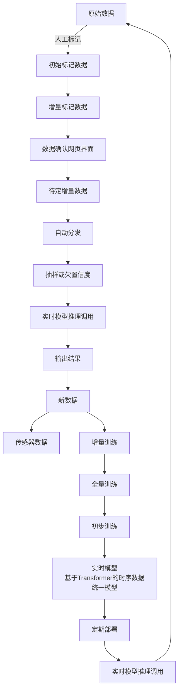

# 增量学习系统详细流程设计

## 1. 增量学习完整流程图

基于您提供的流程图，我们设计了完整的增量学习闭环系统：



## 2. 各阶段详细设计

### 2.1 数据标注阶段 (A → B → C)

#### 2.1.1 原始数据处理
```python
class RawDataProcessor:
    """
    原始数据处理器
    处理来自传感器、数据库、文件系统等的原始数据
    """
    def __init__(self):
        self.data_validator = DataValidator()
        self.format_converter = FormatConverter()
        self.quality_checker = QualityChecker()
    
    def process_raw_data(self, raw_data):
        """
        处理原始数据
        """
        # 1. 数据验证
        validated_data = self.data_validator.validate(raw_data)
        
        # 2. 格式转换
        converted_data = self.format_converter.convert(validated_data)
        
        # 3. 质量检查
        quality_score = self.quality_checker.check(converted_data)
        
        # 4. 数据清洗
        cleaned_data = self.clean_data(converted_data)
        
        return cleaned_data
```

#### 2.1.2 人工标注系统
```python
class AnnotationSystem:
    """
    人工标注系统
    支持多种标注类型和标注质量控制
    """
    def __init__(self):
        self.annotation_interface = AnnotationInterface()
        self.auto_annotator = AutoAnnotator()
        self.quality_validator = QualityValidator()
    
    def create_initial_annotations(self, raw_data):
        """
        创建初始标注数据
        """
        # 1. 自动预标注
        pre_annotations = self.auto_annotator.annotate(raw_data)
        
        # 2. 人工标注界面
        manual_annotations = self.annotation_interface.annotate(
            raw_data, pre_annotations
        )
        
        # 3. 质量验证
        validated_annotations = self.quality_validator.validate(
            manual_annotations
        )
        
        return validated_annotations
    
    def create_incremental_annotations(self, new_data, existing_annotations):
        """
        创建增量标注数据
        """
        # 1. 基于现有标注的智能建议
        annotation_suggestions = self.generate_suggestions(
            new_data, existing_annotations
        )
        
        # 2. 增量标注
        incremental_annotations = self.annotation_interface.incremental_annotate(
            new_data, annotation_suggestions
        )
        
        return incremental_annotations
```

### 2.2 数据确认阶段 (D → E)

#### 2.2.1 数据确认网页界面
```python
class DataConfirmationInterface:
    """
    数据确认网页界面
    提供直观的数据确认和编辑功能
    """
    def __init__(self):
        self.web_ui = WebInterface()
        self.data_editor = DataEditor()
        self.confirmation_manager = ConfirmationManager()
    
    def confirm_data(self, annotated_data):
        """
        数据确认流程
        """
        # 1. 数据展示
        self.web_ui.display_data(annotated_data)
        
        # 2. 用户确认/编辑
        confirmed_data = self.data_editor.edit_data(annotated_data)
        
        # 3. 确认状态管理
        confirmation_status = self.confirmation_manager.manage_status(
            confirmed_data
        )
        
        return confirmed_data, confirmation_status
```

#### 2.2.2 待定增量数据管理
```python
class PendingDataManager:
    """
    待定增量数据管理器
    管理待确认的增量数据
    """
    def __init__(self):
        self.pending_queue = PendingQueue()
        self.priority_manager = PriorityManager()
        self.batch_processor = BatchProcessor()
    
    def add_pending_data(self, data, priority='normal'):
        """
        添加待定数据
        """
        # 1. 优先级设置
        prioritized_data = self.priority_manager.set_priority(data, priority)
        
        # 2. 加入待处理队列
        self.pending_queue.add(prioritized_data)
        
        # 3. 触发批处理
        if self.pending_queue.size() >= self.batch_size:
            self.batch_processor.process_batch(self.pending_queue)
    
    def get_pending_data(self, limit=100):
        """
        获取待定数据
        """
        return self.pending_queue.get_batch(limit)
```

### 2.3 数据分发阶段 (F → G)

#### 2.3.1 自动分发系统
```python
class AutoDistributionSystem:
    """
    自动分发系统
    智能分发数据到不同的处理流程
    """
    def __init__(self):
        self.distribution_rules = DistributionRules()
        self.load_balancer = LoadBalancer()
        self.route_manager = RouteManager()
    
    def distribute_data(self, confirmed_data):
        """
        自动分发数据
        """
        # 1. 分发规则评估
        distribution_plan = self.distribution_rules.evaluate(confirmed_data)
        
        # 2. 负载均衡
        balanced_plan = self.load_balancer.balance(distribution_plan)
        
        # 3. 路由执行
        distributed_data = self.route_manager.execute_routes(balanced_plan)
        
        return distributed_data
```

#### 2.3.2 智能抽样策略
```python
class IntelligentSampling:
    """
    智能抽样策略
    支持多种抽样策略和欠置信度采样
    """
    def __init__(self):
        self.sampling_strategies = {
            'random': RandomSampling(),
            'stratified': StratifiedSampling(),
            'uncertainty': UncertaintySampling(),
            'diversity': DiversitySampling(),
            'active': ActiveLearningSampling()
        }
        self.confidence_estimator = ConfidenceEstimator()
    
    def sample_data(self, data, strategy='uncertainty', sample_size=1000):
        """
        智能抽样
        """
        # 1. 策略选择
        sampler = self.sampling_strategies[strategy]
        
        # 2. 欠置信度评估
        if strategy == 'uncertainty':
            confidence_scores = self.confidence_estimator.estimate(data)
            low_confidence_data = self.filter_low_confidence(
                data, confidence_scores
            )
            sampled_data = sampler.sample(low_confidence_data, sample_size)
        else:
            sampled_data = sampler.sample(data, sample_size)
        
        return sampled_data
    
    def filter_low_confidence(self, data, confidence_scores, threshold=0.7):
        """
        过滤低置信度数据
        """
        low_confidence_indices = confidence_scores < threshold
        return data[low_confidence_indices]
```

### 2.4 实时推理阶段 (H → I)

#### 2.4.1 实时模型推理调用
```python
class RealTimeInferenceService:
    """
    实时模型推理服务
    支持高并发、低延迟的模型推理
    """
    def __init__(self):
        self.model_manager = ModelManager()
        self.inference_engine = InferenceEngine()
        self.result_cache = ResultCache()
        self.load_balancer = LoadBalancer()
    
    async def inference(self, input_data, model_version=None):
        """
        实时推理
        """
        # 1. 缓存检查
        cache_key = self.generate_cache_key(input_data)
        cached_result = await self.result_cache.get(cache_key)
        if cached_result:
            return cached_result
        
        # 2. 模型加载
        model = await self.model_manager.get_model(model_version)
        
        # 3. 负载均衡
        inference_node = self.load_balancer.select_node()
        
        # 4. 推理执行
        result = await inference_node.inference(model, input_data)
        
        # 5. 结果缓存
        await self.result_cache.set(cache_key, result)
        
        return result
    
    def batch_inference(self, batch_data, batch_size=32):
        """
        批量推理
        """
        results = []
        for i in range(0, len(batch_data), batch_size):
            batch = batch_data[i:i+batch_size]
            batch_result = self.inference_engine.batch_inference(batch)
            results.extend(batch_result)
        return results
```

#### 2.4.2 输出结果处理
```python
class OutputResultProcessor:
    """
    输出结果处理器
    处理推理结果并生成新数据
    """
    def __init__(self):
        self.result_validator = ResultValidator()
        self.result_formatter = ResultFormatter()
        self.new_data_generator = NewDataGenerator()
    
    def process_output_results(self, inference_results):
        """
        处理输出结果
        """
        # 1. 结果验证
        validated_results = self.result_validator.validate(inference_results)
        
        # 2. 结果格式化
        formatted_results = self.result_formatter.format(validated_results)
        
        # 3. 新数据生成
        new_data = self.new_data_generator.generate(formatted_results)
        
        return new_data
```

### 2.5 新数据生成阶段 (I → J)

#### 2.5.1 新数据生成器
```python
class NewDataGenerator:
    """
    新数据生成器
    基于推理结果生成新的训练数据
    """
    def __init__(self):
        self.data_synthesizer = DataSynthesizer()
        self.quality_assessor = QualityAssessor()
        self.data_enricher = DataEnricher()
    
    def generate_new_data(self, inference_results):
        """
        生成新数据
        """
        # 1. 数据合成
        synthesized_data = self.data_synthesizer.synthesize(inference_results)
        
        # 2. 质量评估
        quality_score = self.quality_assessor.assess(synthesized_data)
        
        # 3. 数据增强
        if quality_score > self.quality_threshold:
            enriched_data = self.data_enricher.enrich(synthesized_data)
        else:
            enriched_data = synthesized_data
        
        return enriched_data
```

#### 2.5.2 传感器数据集成
```python
class SensorDataIntegrator:
    """
    传感器数据集成器
    集成来自各种传感器的实时数据
    """
    def __init__(self):
        self.sensor_connectors = {
            'temperature': TemperatureSensorConnector(),
            'pressure': PressureSensorConnector(),
            'humidity': HumiditySensorConnector(),
            'motion': MotionSensorConnector(),
            'audio': AudioSensorConnector(),
            'video': VideoSensorConnector()
        }
        self.data_fusion = DataFusion()
    
    def integrate_sensor_data(self, sensor_types):
        """
        集成传感器数据
        """
        sensor_data = {}
        
        for sensor_type in sensor_types:
            if sensor_type in self.sensor_connectors:
                connector = self.sensor_connectors[sensor_type]
                sensor_data[sensor_type] = connector.get_data()
        
        # 数据融合
        fused_data = self.data_fusion.fuse(sensor_data)
        
        return fused_data
```

### 2.6 增量训练阶段 (L → M → N)

#### 2.6.1 增量训练管理器
```python
class IncrementalTrainingManager:
    """
    增量训练管理器
    管理增量训练和全量训练流程
    """
    def __init__(self):
        self.incremental_trainer = IncrementalTrainer()
        self.full_trainer = FullTrainer()
        self.model_version_manager = ModelVersionManager()
        self.training_scheduler = TrainingScheduler()
    
    def start_incremental_training(self, new_data, base_model):
        """
        启动增量训练
        """
        # 1. 增量训练
        incremental_model = self.incremental_trainer.train(
            new_data, base_model
        )
        
        # 2. 模型版本管理
        version_info = self.model_version_manager.create_version(
            incremental_model, 'incremental'
        )
        
        # 3. 性能评估
        performance_metrics = self.evaluate_model(incremental_model)
        
        # 4. 决定是否进行全量训练
        if self.should_full_train(performance_metrics):
            return self.start_full_training(incremental_model)
        else:
            return incremental_model
    
    def start_full_training(self, base_model):
        """
        启动全量训练
        """
        # 1. 全量训练
        full_model = self.full_trainer.train(base_model)
        
        # 2. 模型版本管理
        version_info = self.model_version_manager.create_version(
            full_model, 'full'
        )
        
        return full_model
    
    def should_full_train(self, performance_metrics):
        """
        判断是否需要全量训练
        """
        # 基于性能指标判断是否需要全量训练
        accuracy_threshold = 0.95
        return performance_metrics['accuracy'] < accuracy_threshold
```

#### 2.6.2 Transformer时序数据统一模型
```python
class TransformerTimeSeriesModel(nn.Module):
    """
    基于Transformer的时序数据统一模型
    支持多模态时序数据输入和增量学习
    """
    def __init__(self, config):
        super().__init__()
        self.config = config
        
        # 多模态输入编码器
        self.input_encoders = nn.ModuleDict({
            'sensor': SensorEncoder(config.sensor_dim),
            'text': TextEncoder(config.text_dim),
            'image': ImageEncoder(config.image_dim),
            'audio': AudioEncoder(config.audio_dim),
            'video': VideoEncoder(config.video_dim)
        })
        
        # 位置编码
        self.position_encoder = PositionalEncoding(config.hidden_size)
        
        # Transformer编码器
        self.transformer_encoder = nn.TransformerEncoder(
            nn.TransformerEncoderLayer(
                d_model=config.hidden_size,
                nhead=config.num_heads,
                dim_feedforward=config.ffn_size,
                dropout=config.dropout,
                activation='gelu'
            ),
            num_layers=config.num_layers,
            norm=nn.LayerNorm(config.hidden_size)
        )
        
        # 时序建模组件
        self.temporal_encoder = TemporalEncoder(config)
        
        # 多任务输出头
        self.output_heads = nn.ModuleDict({
            'classification': ClassificationHead(config),
            'regression': RegressionHead(config),
            'forecasting': ForecastingHead(config),
            'anomaly_detection': AnomalyDetectionHead(config),
            'segmentation': SegmentationHead(config)
        })
        
        # 增量学习组件
        self.incremental_learner = IncrementalLearner(config)
        
        # 知识蒸馏组件
        self.knowledge_distiller = KnowledgeDistiller(config)
    
    def forward(self, inputs, task_type='classification'):
        """
        前向传播
        """
        # 1. 多模态特征提取
        features = {}
        for modality, data in inputs.items():
            if modality in self.input_encoders:
                features[modality] = self.input_encoders[modality](data)
        
        # 2. 特征融合
        fused_features = self.fuse_multimodal_features(features)
        
        # 3. 位置编码
        position_encoded = self.position_encoder(fused_features)
        
        # 4. Transformer编码
        transformer_output = self.transformer_encoder(position_encoded)
        
        # 5. 时序建模
        temporal_features = self.temporal_encoder(transformer_output)
        
        # 6. 任务特定输出
        output = self.output_heads[task_type](temporal_features)
        
        return output
    
    def fuse_multimodal_features(self, features):
        """
        多模态特征融合
        """
        # 特征对齐
        aligned_features = self.align_features(features)
        
        # 特征融合
        fused_features = torch.cat(aligned_features, dim=-1)
        
        # 特征降维
        fused_features = self.feature_projection(fused_features)
        
        return fused_features
    
    def incremental_update(self, new_data, task_type='classification'):
        """
        增量学习更新
        """
        return self.incremental_learner.update(self, new_data, task_type)
```

### 2.7 模型部署阶段 (O → P → Q)

#### 2.7.1 模型部署管理器
```python
class ModelDeploymentManager:
    """
    模型部署管理器
    管理模型的定期部署和版本控制
    """
    def __init__(self):
        self.deployment_scheduler = DeploymentScheduler()
        self.model_validator = ModelValidator()
        self.deployment_engine = DeploymentEngine()
        self.rollback_manager = RollbackManager()
    
    def schedule_deployment(self, model, deployment_config):
        """
        调度模型部署
        """
        # 1. 模型验证
        validation_result = self.model_validator.validate(model)
        
        if not validation_result['is_valid']:
            raise ModelValidationError(validation_result['errors'])
        
        # 2. 部署调度
        deployment_plan = self.deployment_scheduler.create_plan(
            model, deployment_config
        )
        
        # 3. 执行部署
        deployment_result = self.deployment_engine.deploy(deployment_plan)
        
        # 4. 部署验证
        deployment_status = self.verify_deployment(deployment_result)
        
        return deployment_status
    
    def periodic_deployment(self, model_versions):
        """
        定期部署
        """
        for version in model_versions:
            if self.should_deploy(version):
                self.schedule_deployment(version.model, version.config)
    
    def should_deploy(self, model_version):
        """
        判断是否应该部署
        """
        # 基于时间、性能、稳定性等指标判断
        time_since_last_deployment = time.time() - model_version.last_deployment
        performance_improvement = model_version.performance_improvement
        
        return (time_since_last_deployment > self.deployment_interval or
                performance_improvement > self.performance_threshold)
```

#### 2.7.2 实时推理服务
```python
class RealTimeInferenceService:
    """
    实时推理服务
    提供高可用、低延迟的模型推理服务
    """
    def __init__(self):
        self.model_loader = ModelLoader()
        self.inference_engine = InferenceEngine()
        self.load_balancer = LoadBalancer()
        self.monitoring = Monitoring()
        self.cache_manager = CacheManager()
    
    async def inference(self, input_data, model_version=None):
        """
        实时推理
        """
        try:
            # 1. 缓存检查
            cache_key = self.generate_cache_key(input_data)
            cached_result = await self.cache_manager.get(cache_key)
            if cached_result:
                return cached_result
            
            # 2. 模型加载
            model = await self.model_loader.load_model(model_version)
            
            # 3. 负载均衡
            inference_node = self.load_balancer.select_node()
            
            # 4. 推理执行
            start_time = time.time()
            result = await inference_node.inference(model, input_data)
            inference_time = time.time() - start_time
            
            # 5. 结果缓存
            await self.cache_manager.set(cache_key, result)
            
            # 6. 监控记录
            self.monitoring.record_inference(
                model_version, inference_time, len(input_data)
            )
            
            return result
            
        except Exception as e:
            # 错误处理和降级
            self.monitoring.record_error(e)
            return self.fallback_inference(input_data)
    
    def batch_inference(self, batch_data, batch_size=32):
        """
        批量推理
        """
        results = []
        for i in range(0, len(batch_data), batch_size):
            batch = batch_data[i:i+batch_size]
            batch_result = self.inference_engine.batch_inference(batch)
            results.extend(batch_result)
        return results
```

## 3. 系统集成和优化

### 3.1 数据流优化
```python
class DataFlowOptimizer:
    """
    数据流优化器
    优化整个增量学习流程的数据流
    """
    def __init__(self):
        self.pipeline_optimizer = PipelineOptimizer()
        self.cache_optimizer = CacheOptimizer()
        self.storage_optimizer = StorageOptimizer()
    
    def optimize_data_flow(self, data_flow_config):
        """
        优化数据流
        """
        # 1. Pipeline优化
        optimized_pipeline = self.pipeline_optimizer.optimize(
            data_flow_config.pipeline
        )
        
        # 2. 缓存优化
        cache_strategy = self.cache_optimizer.optimize(
            data_flow_config.cache
        )
        
        # 3. 存储优化
        storage_strategy = self.storage_optimizer.optimize(
            data_flow_config.storage
        )
        
        return {
            'pipeline': optimized_pipeline,
            'cache': cache_strategy,
            'storage': storage_strategy
        }
```

### 3.2 性能监控
```python
class PerformanceMonitor:
    """
    性能监控器
    监控整个增量学习系统的性能
    """
    def __init__(self):
        self.metrics_collector = MetricsCollector()
        self.alert_manager = AlertManager()
        self.performance_analyzer = PerformanceAnalyzer()
    
    def monitor_performance(self):
        """
        监控性能
        """
        # 1. 收集指标
        metrics = self.metrics_collector.collect()
        
        # 2. 性能分析
        analysis = self.performance_analyzer.analyze(metrics)
        
        # 3. 告警检查
        alerts = self.alert_manager.check_alerts(analysis)
        
        return analysis, alerts
```

## 4. 总结

本设计文档基于您提供的增量学习流程图，详细设计了完整的增量学习系统。系统具备以下核心特性：

1. **完整的闭环流程**：从数据标注到模型部署的完整闭环
2. **Transformer时序数据统一模型**：支持多模态时序数据和增量学习
3. **智能数据管理**：自动分发、智能抽样、质量检查
4. **实时推理服务**：高并发、低延迟的模型推理
5. **增量训练支持**：知识蒸馏、弹性权重巩固等增量学习算法
6. **模型部署管理**：定期部署、版本控制、回滚机制
7. **性能优化**：数据流优化、缓存优化、存储优化
8. **监控告警**：完整的性能监控和告警系统

系统采用微服务架构，支持高可用、可扩展、易维护的特点，能够满足复杂的增量学习需求。 