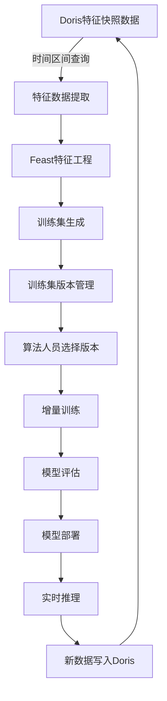

# 训练存储工作流平台详细设计文档

## 1. 系统概述

### 1.1 项目目标
构建一个独立的训练平台，支持Pipeline编排、增量学习、多挂载点管理和多用户并发训练，基于Doris数据源和Feast特征平台，不依赖Cube-Studio。

### 1.2 核心特性
- **Pipeline编排**：支持复杂的训练流程编排和DAG管理
- **增量学习**：基于Transformer的时序数据统一模型，支持连续增量训练
- **多挂载点管理**：支持多种存储类型和动态挂载
- **多用户并发**：支持多用户同时操作同一数据集
- **实时推理**：支持模型实时推理调用和部署
- **Doris集成**：基于Doris数据库的特征快照数据源
- **Feast特征平台**：基于Feast的特征工程和训练集生成
- **训练集版本管理**：支持训练集版本控制和优质版本选择

## 2. 系统架构设计

### 2.1 整体架构
```
┌─────────────────────────────────────────────────────────────┐
│                    用户界面层                                │
├─────────────────────────────────────────────────────────────┤
│  Web UI  │  API Gateway  │  CLI Client  │  SDK Library     │
├─────────────────────────────────────────────────────────────┤
│                    业务逻辑层                                │
├─────────────────────────────────────────────────────────────┤
│ Pipeline │  任务调度  │  数据管理  │  模型管理  │  权限管理  │
│  编排服务 │   服务    │   服务    │   服务    │   服务    │
├─────────────────────────────────────────────────────────────┤
│                    特征工程层                                │
├─────────────────────────────────────────────────────────────┤
│  Feast特征平台  │  特征快照管理  │  训练集生成  │  版本管理  │
├─────────────────────────────────────────────────────────────┤
│                    数据存储层                                │
├─────────────────────────────────────────────────────────────┤
│  Doris  │  PostgreSQL  │  Redis  │  MinIO  │  NFS  │  本地存储 │
├─────────────────────────────────────────────────────────────┤
│                    基础设施层                                │
├─────────────────────────────────────────────────────────────┤
│  Kubernetes  │  Docker  │  监控系统  │  日志系统  │  安全系统 │
└─────────────────────────────────────────────────────────────┘
```

### 2.2 核心服务设计

#### 2.2.1 Pipeline编排服务
- **Pipeline定义管理**：支持YAML/JSON格式的Pipeline配置
- **DAG解析引擎**：基于有向无环图的任务依赖关系管理
- **版本控制**：Pipeline版本管理和回滚机制
- **参数管理**：全局参数和变量管理

#### 2.2.2 任务调度服务
- **资源调度**：CPU、GPU、内存的细粒度资源配置
- **任务编排**：基于优先级的任务调度策略
- **状态监控**：实时监控任务执行状态
- **容错机制**：任务失败自动重试和恢复

#### 2.2.3 数据管理服务
- **Doris连接管理**：Doris数据库连接和查询管理
- **特征快照处理**：特征快照数据的解析和处理
- **训练集版本管理**：训练集版本控制和优质版本选择
- **权限控制**：数据访问权限和审计

#### 2.2.4 模型管理服务
- **模型版本管理**：模型版本化和回滚机制
- **模型部署**：支持实时推理和批量推理
- **模型监控**：模型性能监控和告警
- **A/B测试**：模型对比测试和评估

## 3. Doris数据源集成设计

### 3.1 Doris连接管理器
```python
class DorisConnectionManager:
    """
    Doris数据库连接管理器
    管理Doris数据库连接和查询操作
    """
    def __init__(self, config):
        self.config = config
        self.connection_pool = ConnectionPool()
        self.query_optimizer = QueryOptimizer()
        self.data_parser = DataParser()
    
    def connect(self):
        """
        建立Doris连接
        """
        connection_config = {
            'host': self.config.doris_host,
            'port': self.config.doris_port,
            'user': self.config.doris_user,
            'password': self.config.doris_password,
            'database': self.config.doris_database
        }
        return self.connection_pool.get_connection(connection_config)
    
    def query_features_by_time_range(self, start_time, end_time, filters=None):
        """
        根据时间区间查询特征数据
        """
        # 构建查询SQL
        query_sql = self.build_time_range_query(start_time, end_time, filters)
        
        # 执行查询
        with self.connect() as conn:
            cursor = conn.cursor()
            cursor.execute(query_sql)
            results = cursor.fetchall()
        
        # 解析特征快照数据
        parsed_data = self.data_parser.parse_feature_snapshots(results)
        
        return parsed_data
    
    def build_time_range_query(self, start_time, end_time, filters=None):
        """
        构建时间区间查询SQL
        """
        base_sql = """
        SELECT * FROM feature_snapshots 
        WHERE time >= %s AND time <= %s
        """
        
        if filters:
            filter_conditions = []
            for key, value in filters.items():
                filter_conditions.append(f"{key} = '{value}'")
            
            if filter_conditions:
                base_sql += " AND " + " AND ".join(filter_conditions)
        
        base_sql += " ORDER BY time ASC"
        
        return base_sql, (start_time, end_time)
```

### 3.2 特征快照解析器
```python
class FeatureSnapshotParser:
    """
    特征快照解析器
    解析Doris中的特征快照数据
    """
    def __init__(self):
        self.feature_extractors = {
            'meanLf': self.extract_numeric_feature,
            'std': self.extract_numeric_feature,
            'peakPowers': self.extract_array_feature,
            'peakFreqs': self.extract_array_feature,
            'bandSpectrum': self.extract_array_feature,
            'feature1': self.extract_array_feature,
            'feature2': self.extract_array_feature,
            'feature3': self.extract_array_feature,
            'feature4': self.extract_array_feature,
            'mean': self.extract_numeric_feature,
            'meanHf': self.extract_numeric_feature,
            'temperature': self.extract_numeric_feature,
            'extend': self.extract_json_feature
        }
    
    def parse_feature_snapshots(self, raw_data):
        """
        解析特征快照数据
        """
        parsed_features = []
        
        for record in raw_data:
            feature_snapshot = self.parse_single_snapshot(record)
            parsed_features.append(feature_snapshot)
        
        return parsed_features
    
    def parse_single_snapshot(self, record):
        """
        解析单个特征快照
        """
        feature_data = record['feature']
        parsed_snapshot = {
            'uuid': feature_data.get('uuid'),
            'nodeId': feature_data.get('nodeId'),
            'time': feature_data.get('time'),
            'is_tag': feature_data.get('is_tag'),
            'features': {}
        }
        
        # 解析各个特征
        for feature_name, feature_value in feature_data.items():
            if feature_name in self.feature_extractors:
                parsed_value = self.feature_extractors[feature_name](feature_value)
                parsed_snapshot['features'][feature_name] = parsed_value
        
        return parsed_snapshot
    
    def extract_numeric_feature(self, value):
        """
        提取数值特征
        """
        try:
            return float(value) if value else 0.0
        except (ValueError, TypeError):
            return 0.0
    
    def extract_array_feature(self, value):
        """
        提取数组特征
        """
        if not value:
            return []
        
        try:
            return [float(x.strip()) for x in value.split(',') if x.strip()]
        except (ValueError, TypeError):
            return []
    
    def extract_json_feature(self, value):
        """
        提取JSON特征
        """
        if not value:
            return {}
        
        try:
            return json.loads(value)
        except (ValueError, TypeError):
            return {}
```

## 4. Feast特征平台集成

### 4.1 Feast特征工程管理器
```python
class FeastFeatureEngineeringManager:
    """
    Feast特征工程管理器
    基于Feast平台进行特征工程和训练集生成
    """
    def __init__(self, config):
        self.config = config
        self.feast_client = FeastClient()
        self.feature_store = FeatureStore()
        self.training_set_generator = TrainingSetGenerator()
    
    def create_feature_views(self, feature_snapshots):
        """
        创建特征视图
        """
        # 定义特征视图
        feature_views = []
        
        # 基础特征视图
        basic_features = FeatureView(
            name="basic_features",
            entities=["uuid", "nodeId"],
            features=[
                Feature("meanLf", ValueType.FLOAT),
                Feature("std", ValueType.FLOAT),
                Feature("mean", ValueType.FLOAT),
                Feature("meanHf", ValueType.FLOAT),
                Feature("temperature", ValueType.FLOAT)
            ],
            ttl=timedelta(days=30)
        )
        feature_views.append(basic_features)
        
        # 数组特征视图
        array_features = FeatureView(
            name="array_features",
            entities=["uuid", "nodeId"],
            features=[
                Feature("peakPowers", ValueType.FLOAT_LIST),
                Feature("peakFreqs", ValueType.FLOAT_LIST),
                Feature("bandSpectrum", ValueType.FLOAT_LIST),
                Feature("feature1", ValueType.FLOAT_LIST),
                Feature("feature2", ValueType.FLOAT_LIST),
                Feature("feature3", ValueType.FLOAT_LIST),
                Feature("feature4", ValueType.FLOAT_LIST)
            ],
            ttl=timedelta(days=30)
        )
        feature_views.append(array_features)
        
        return feature_views
    
    def generate_training_set(self, feature_views, time_range, entity_list):
        """
        生成训练集
        """
        # 创建训练集配置
        training_set_config = TrainingSetConfig(
            name="incremental_training_set",
            feature_views=feature_views,
            entities=entity_list,
            time_range=time_range
        )
        
        # 生成训练集
        training_set = self.training_set_generator.generate(training_set_config)
        
        return training_set
    
    def save_training_set(self, training_set, version_info):
        """
        保存训练集
        """
        # 保存到特征存储
        training_set_id = self.feature_store.save_training_set(
            training_set, version_info
        )
        
        return training_set_id
```

### 4.2 训练集版本管理器
```python
class TrainingSetVersionManager:
    """
    训练集版本管理器
    管理训练集的版本控制和优质版本选择
    """
    def __init__(self):
        self.version_store = VersionStore()
        self.quality_assessor = QualityAssessor()
        self.metadata_manager = MetadataManager()
    
    def create_version(self, training_set, metadata):
        """
        创建训练集版本
        """
        # 生成版本ID
        version_id = self.generate_version_id()
        
        # 质量评估
        quality_metrics = self.quality_assessor.assess(training_set)
        
        # 版本信息
        version_info = {
            'version_id': version_id,
            'creation_time': datetime.now(),
            'training_set': training_set,
            'metadata': metadata,
            'quality_metrics': quality_metrics,
            'status': 'active'
        }
        
        # 保存版本
        self.version_store.save_version(version_info)
        
        # 更新元数据
        self.metadata_manager.update_metadata(version_info)
        
        return version_id
    
    def list_versions(self, filters=None):
        """
        列出可用版本
        """
        versions = self.version_store.list_versions(filters)
        
        # 按质量排序
        sorted_versions = sorted(
            versions, 
            key=lambda x: x['quality_metrics']['overall_score'], 
            reverse=True
        )
        
        return sorted_versions
    
    def select_best_version(self, criteria):
        """
        选择最佳版本
        """
        available_versions = self.list_versions()
        
        # 根据标准筛选
        filtered_versions = self.filter_by_criteria(
            available_versions, criteria
        )
        
        if not filtered_versions:
            return None
        
        # 返回质量最高的版本
        return filtered_versions[0]
    
    def filter_by_criteria(self, versions, criteria):
        """
        根据标准筛选版本
        """
        filtered = []
        
        for version in versions:
            if self.matches_criteria(version, criteria):
                filtered.append(version)
        
        return filtered
    
    def matches_criteria(self, version, criteria):
        """
        检查版本是否匹配标准
        """
        quality_metrics = version['quality_metrics']
        
        # 数据量标准
        if 'min_data_size' in criteria:
            if quality_metrics['data_size'] < criteria['min_data_size']:
                return False
        
        # 质量分数标准
        if 'min_quality_score' in criteria:
            if quality_metrics['overall_score'] < criteria['min_quality_score']:
                return False
        
        # 时间范围标准
        if 'time_range' in criteria:
            creation_time = version['creation_time']
            if not self.is_in_time_range(creation_time, criteria['time_range']):
                return False
        
        return True
```

## 5. 增量学习系统设计

### 5.1 基于Doris的增量学习流程



### 5.2 增量学习管理器
```python
class IncrementalLearningManager:
    """
    增量学习管理器
    基于Doris数据源和Feast特征平台的增量学习
    """
    def __init__(self, config):
        self.config = config
        self.doris_manager = DorisConnectionManager(config)
        self.feast_manager = FeastFeatureEngineeringManager(config)
        self.version_manager = TrainingSetVersionManager()
        self.model_trainer = ModelTrainer()
    
    def start_incremental_learning(self, time_range, entity_list, model_config):
        """
        启动增量学习流程
        """
        # 1. 从Doris查询特征数据
        feature_snapshots = self.doris_manager.query_features_by_time_range(
            time_range['start'], time_range['end']
        )
        
        # 2. Feast特征工程
        feature_views = self.feast_manager.create_feature_views(feature_snapshots)
        
        # 3. 生成训练集
        training_set = self.feast_manager.generate_training_set(
            feature_views, time_range, entity_list
        )
        
        # 4. 创建版本
        version_metadata = {
            'time_range': time_range,
            'entity_count': len(entity_list),
            'feature_count': len(feature_snapshots),
            'learning_type': 'incremental'
        }
        
        version_id = self.version_manager.create_version(
            training_set, version_metadata
        )
        
        # 5. 增量训练
        model = self.model_trainer.train_incremental(
            training_set, model_config
        )
        
        return {
            'version_id': version_id,
            'model': model,
            'training_set': training_set
        }
    
    def select_training_data(self, criteria):
        """
        选择训练数据
        """
        # 获取最佳版本
        best_version = self.version_manager.select_best_version(criteria)
        
        if not best_version:
            raise ValueError("No suitable training set version found")
        
        return best_version['training_set']
```

## 6. 多挂载点管理系统

### 6.1 存储抽象层
```python
class StorageManager:
    """
    统一存储管理器
    支持多种存储类型和动态挂载
    """
    def __init__(self):
        self.storage_providers = {
            'pvc': PVCProvider(),
            'hostpath': HostPathProvider(),
            'configmap': ConfigMapProvider(),
            'secret': SecretProvider(),
            'memory': MemoryProvider(),
            'nfs': NFSProvider(),
            's3': S3Provider()
        }
    
    def mount_storage(self, mount_config):
        """
        动态挂载存储
        """
        provider = self.storage_providers[mount_config.type]
        return provider.mount(mount_config)
    
    def optimize_storage(self, data_access_pattern):
        """
        存储优化
        根据数据访问模式选择最优存储
        """
        return self.storage_optimizer.optimize(data_access_pattern)
```

### 6.2 多用户并发处理
```python
class MultiUserStorageManager:
    """
    多用户存储管理器
    支持写时复制、用户空间隔离、版本锁管理
    """
    def __init__(self):
        self.copy_on_write = CopyOnWriteManager()
        self.user_isolation = UserIsolationManager()
        self.version_lock = VersionLockManager()
    
    def handle_concurrent_access(self, user_id, dataset_id, operation):
        """
        处理多用户并发访问
        """
        # 1. 版本锁检查
        if not self.version_lock.acquire_lock(dataset_id, user_id):
            raise ConcurrentAccessError("数据集被其他用户锁定")
        
        try:
            # 2. 写时复制
            if operation.type == 'write':
                copied_dataset = self.copy_on_write.copy_dataset(dataset_id, user_id)
                result = operation.execute(copied_dataset)
                return result
            
            # 3. 用户空间隔离
            isolated_dataset = self.user_isolation.isolate_dataset(dataset_id, user_id)
            result = operation.execute(isolated_dataset)
            return result
            
        finally:
            # 4. 释放锁
            self.version_lock.release_lock(dataset_id, user_id)
```

## 7. Pipeline编排系统

### 7.1 Pipeline定义
```yaml
# 基于Doris和Feast的增量学习Pipeline示例
apiVersion: train-platform/v1
kind: Pipeline
metadata:
  name: doris-feast-incremental-pipeline
  version: "1.0.0"
spec:
  tasks:
    - name: doris-data-query
      type: data_query
      image: train-platform/doris-query:latest
      resources:
        cpu: "2"
        memory: "4Gi"
      inputs:
        - name: time_range
          source: "parameters"
        - name: entity_list
          source: "parameters"
      outputs:
        - name: feature_snapshots
          destination: "/mnt/user/data/feature_snapshots"
    
    - name: feast-feature-engineering
      type: feature_engineering
      image: train-platform/feast-engine:latest
      resources:
        cpu: "4"
        memory: "8Gi"
      inputs:
        - name: feature_snapshots
          source: "/mnt/user/data/feature_snapshots"
      outputs:
        - name: training_set
          destination: "/mnt/user/data/training_set"
    
    - name: training-set-versioning
      type: versioning
      image: train-platform/version-manager:latest
      resources:
        cpu: "2"
        memory: "4Gi"
      inputs:
        - name: training_set
          source: "/mnt/user/data/training_set"
      outputs:
        - name: versioned_training_set
          destination: "/mnt/user/data/versioned_training_set"
    
    - name: model-training
      type: training
      image: train-platform/transformer-training:latest
      resources:
        cpu: "8"
        memory: "16Gi"
        gpu: "1"
      inputs:
        - name: training_set
          source: "/mnt/user/data/versioned_training_set"
        - name: base_model
          source: "/mnt/user/models/base"
      outputs:
        - name: trained_model
          destination: "/mnt/user/models/incremental"
    
    - name: model-evaluation
      type: evaluation
      image: train-platform/model-eval:latest
      resources:
        cpu: "4"
        memory: "8Gi"
      inputs:
        - name: model
          source: "/mnt/user/models/incremental"
        - name: test_data
          source: "/mnt/user/data/test"
      outputs:
        - name: evaluation_results
          destination: "/mnt/user/results/evaluation"
    
    - name: model-deployment
      type: deployment
      image: train-platform/model-deploy:latest
      resources:
        cpu: "2"
        memory: "4Gi"
      inputs:
        - name: model
          source: "/mnt/user/models/incremental"
      outputs:
        - name: deployed_model
          destination: "/mnt/user/models/deployed"
  
  dependencies:
    - from: doris-data-query
      to: feast-feature-engineering
    - from: feast-feature-engineering
      to: training-set-versioning
    - from: training-set-versioning
      to: model-training
    - from: model-training
      to: model-evaluation
    - from: model-evaluation
      to: model-deployment
  
  parameters:
    time_range:
      start: "2024-01-01T00:00:00Z"
      end: "2024-01-31T23:59:59Z"
    entity_list: ["uuid1", "uuid2", "uuid3"]
    learning_rate: 0.001
    batch_size: 32
    epochs: 100
    incremental_ratio: 0.1
```

### 7.2 Pipeline执行引擎
```python
class PipelineExecutor:
    """
    Pipeline执行引擎
    支持DAG解析、任务调度、状态管理
    """
    def __init__(self):
        self.dag_parser = DAGParser()
        self.task_scheduler = TaskScheduler()
        self.state_manager = StateManager()
    
    async def execute_pipeline(self, pipeline_config, parameters=None):
        """
        执行Pipeline
        """
        # 1. DAG解析
        dag = self.dag_parser.parse(pipeline_config)
        
        # 2. 任务调度
        execution_plan = self.task_scheduler.create_plan(dag)
        
        # 3. 执行任务
        for task in execution_plan:
            await self.execute_task(task, parameters)
            
            # 4. 状态更新
            self.state_manager.update_task_status(task.id, 'completed')
        
        return execution_plan
```

## 8. 监控和运维

### 8.1 系统监控
```python
class SystemMonitor:
    """
    系统监控服务
    监控系统性能、资源使用、任务状态
    """
    def __init__(self):
        self.metrics_collector = MetricsCollector()
        self.alert_manager = AlertManager()
        self.log_aggregator = LogAggregator()
    
    def monitor_system_health(self):
        """
        监控系统健康状态
        """
        # 收集指标
        metrics = self.metrics_collector.collect()
        
        # 检查告警
        alerts = self.alert_manager.check_alerts(metrics)
        
        # 记录日志
        self.log_aggregator.aggregate(metrics, alerts)
        
        return metrics, alerts
```

### 8.2 性能优化
```python
class PerformanceOptimizer:
    """
    性能优化服务
    自动优化系统性能
    """
    def __init__(self):
        self.resource_optimizer = ResourceOptimizer()
        self.cache_optimizer = CacheOptimizer()
        self.storage_optimizer = StorageOptimizer()
    
    def optimize_system_performance(self):
        """
        优化系统性能
        """
        # 资源优化
        self.resource_optimizer.optimize()
        
        # 缓存优化
        self.cache_optimizer.optimize()
        
        # 存储优化
        self.storage_optimizer.optimize()
```

## 9. 安全设计

### 9.1 认证和授权
```python
class SecurityManager:
    """
    安全管理器
    处理认证、授权、数据加密
    """
    def __init__(self):
        self.auth_service = AuthService()
        self.permission_manager = PermissionManager()
        self.encryption_service = EncryptionService()
    
    def authenticate_user(self, credentials):
        """
        用户认证
        """
        return self.auth_service.authenticate(credentials)
    
    def authorize_access(self, user, resource, operation):
        """
        访问授权
        """
        return self.permission_manager.authorize(user, resource, operation)
    
    def encrypt_data(self, data):
        """
        数据加密
        """
        return self.encryption_service.encrypt(data)
```

## 10. 部署架构

### 10.1 Kubernetes部署
```yaml
# 核心服务部署配置
apiVersion: apps/v1
kind: Deployment
metadata:
  name: train-platform-core
  namespace: train-platform
spec:
  replicas: 3
  selector:
    matchLabels:
      app: train-platform-core
  template:
    metadata:
      labels:
        app: train-platform-core
    spec:
      containers:
        - name: pipeline-service
          image: train-platform/pipeline-service:latest
          ports:
            - containerPort: 8080
          env:
            - name: DORIS_HOST
              valueFrom:
                secretKeyRef:
                  name: doris-secret
                  key: host
            - name: DORIS_PORT
              valueFrom:
                secretKeyRef:
                  name: doris-secret
                  key: port
            - name: DORIS_USER
              valueFrom:
                secretKeyRef:
                  name: doris-secret
                  key: user
            - name: DORIS_PASSWORD
              valueFrom:
                secretKeyRef:
                  name: doris-secret
                  key: password
            - name: FEAST_CONFIG
              valueFrom:
                configMapKeyRef:
                  name: feast-config
                  key: config.yaml
          resources:
            requests:
              cpu: "500m"
              memory: "1Gi"
            limits:
              cpu: "2"
              memory: "4Gi"
        
        - name: doris-connector
          image: train-platform/doris-connector:latest
          ports:
            - containerPort: 8081
          env:
            - name: DORIS_HOST
              valueFrom:
                secretKeyRef:
                  name: doris-secret
                  key: host
            - name: DORIS_PORT
              valueFrom:
                secretKeyRef:
                  name: doris-secret
                  key: port
          resources:
            requests:
              cpu: "1"
              memory: "2Gi"
            limits:
              cpu: "4"
              memory: "8Gi"
        
        - name: feast-service
          image: train-platform/feast-service:latest
          ports:
            - containerPort: 8082
          env:
            - name: FEAST_CONFIG
              valueFrom:
                configMapKeyRef:
                  name: feast-config
                  key: config.yaml
          resources:
            requests:
              cpu: "2"
              memory: "4Gi"
            limits:
              cpu: "8"
              memory: "16Gi"
```

### 10.2 高可用配置
```yaml
# 高可用配置
apiVersion: v1
kind: Service
metadata:
  name: train-platform-service
  namespace: train-platform
spec:
  type: LoadBalancer
  ports:
    - port: 80
      targetPort: 8080
      protocol: TCP
  selector:
    app: train-platform-core
---
apiVersion: autoscaling/v2
kind: HorizontalPodAutoscaler
metadata:
  name: train-platform-hpa
  namespace: train-platform
spec:
  scaleTargetRef:
    apiVersion: apps/v1
    kind: Deployment
    name: train-platform-core
  minReplicas: 3
  maxReplicas: 10
  metrics:
    - type: Resource
      resource:
        name: cpu
        target:
          type: Utilization
          averageUtilization: 70
    - type: Resource
      resource:
        name: memory
        target:
          type: Utilization
          averageUtilization: 80
```

## 11. 数据流程示例

### 11.1 特征快照数据处理示例
```python
# 示例：处理Doris中的特征快照数据
def process_feature_snapshot_example():
    """
    处理特征快照数据示例
    """
    # 1. 从Doris查询数据
    doris_manager = DorisConnectionManager(config)
    feature_snapshots = doris_manager.query_features_by_time_range(
        start_time="1670387403396",
        end_time="1670473803396"
    )
    
    # 2. 解析特征快照
    parser = FeatureSnapshotParser()
    parsed_features = parser.parse_feature_snapshots(feature_snapshots)
    
    # 示例数据：
    # {
    #     'uuid': '704A0ED440F4',
    #     'nodeId': '1465',
    #     'time': '1670387403396',
    #     'is_tag': True,
    #     'features': {
    #         'meanLf': 8478281.0,
    #         'std': 4.0,
    #         'peakPowers': [9.31, 9.25, 8.94, ...],
    #         'peakFreqs': [4.95, 5.46, 5.72, ...],
    #         'bandSpectrum': [13.53, 12.81, 12.68, ...],
    #         'feature1': [21.88, 21.99, 22.05, ...],
    #         'feature2': [16.51, 16.05, 15.96, ...],
    #         'feature3': [12.56, 12.63, 12.7, ...],
    #         'feature4': [1.66, 1.61, 1.55, ...],
    #         'mean': 305057.0,
    #         'meanHf': 3506121029.0,
    #         'temperature': -274.0,
    #         'extend': {'SerialData': '', 'GpioData': -1}
    #     }
    # }
    
    # 3. Feast特征工程
    feast_manager = FeastFeatureEngineeringManager(config)
    feature_views = feast_manager.create_feature_views(parsed_features)
    
    # 4. 生成训练集
    time_range = {
        'start': '1670387403396',
        'end': '1670473803396'
    }
    entity_list = ['704A0ED440F4', '704A0ED440F5', '704A0ED440F6']
    
    training_set = feast_manager.generate_training_set(
        feature_views, time_range, entity_list
    )
    
    # 5. 版本管理
    version_manager = TrainingSetVersionManager()
    version_id = version_manager.create_version(
        training_set, 
        {'description': 'Incremental training set v1.0'}
    )
    
    return version_id
```

### 11.2 训练集选择示例
```python
# 示例：算法人员选择训练集版本
def select_training_set_example():
    """
    选择训练集版本示例
    """
    version_manager = TrainingSetVersionManager()
    
    # 定义选择标准
    criteria = {
        'min_data_size': 10000,  # 最少10000条记录
        'min_quality_score': 0.8,  # 最低质量分数0.8
        'time_range': {
            'start': '2024-01-01T00:00:00Z',
            'end': '2024-01-31T23:59:59Z'
        }
    }
    
    # 选择最佳版本
    best_version = version_manager.select_best_version(criteria)
    
    if best_version:
        print(f"选择版本: {best_version['version_id']}")
        print(f"质量分数: {best_version['quality_metrics']['overall_score']}")
        print(f"数据量: {best_version['quality_metrics']['data_size']}")
        
        return best_version['training_set']
    else:
        print("未找到符合条件的训练集版本")
        return None
```

## 12. API接口设计

### 12.1 训练集管理API
```python
# 训练集管理API接口
class TrainingSetAPI:
    """
    训练集管理API
    """
    
    @app.route('/api/v1/training-sets', methods=['POST'])
    def create_training_set():
        """
        创建训练集
        """
        data = request.get_json()
        
        # 从Doris查询数据
        doris_manager = DorisConnectionManager(config)
        feature_snapshots = doris_manager.query_features_by_time_range(
            data['time_range']['start'],
            data['time_range']['end'],
            data.get('filters')
        )
        
        # Feast特征工程
        feast_manager = FeastFeatureEngineeringManager(config)
        feature_views = feast_manager.create_feature_views(feature_snapshots)
        
        # 生成训练集
        training_set = feast_manager.generate_training_set(
            feature_views, 
            data['time_range'], 
            data['entity_list']
        )
        
        # 创建版本
        version_manager = TrainingSetVersionManager()
        version_id = version_manager.create_version(
            training_set, 
            data.get('metadata', {})
        )
        
        return jsonify({
            'version_id': version_id,
            'status': 'success'
        })
    
    @app.route('/api/v1/training-sets/versions', methods=['GET'])
    def list_versions():
        """
        列出训练集版本
        """
        filters = request.args.to_dict()
        version_manager = TrainingSetVersionManager()
        versions = version_manager.list_versions(filters)
        
        return jsonify({
            'versions': versions,
            'total': len(versions)
        })
    
    @app.route('/api/v1/training-sets/versions/<version_id>', methods=['GET'])
    def get_version(version_id):
        """
        获取特定版本
        """
        version_manager = TrainingSetVersionManager()
        version = version_manager.get_version(version_id)
        
        if not version:
            return jsonify({'error': 'Version not found'}), 404
        
        return jsonify(version)
    
    @app.route('/api/v1/training-sets/select', methods=['POST'])
    def select_training_set():
        """
        选择训练集
        """
        data = request.get_json()
        version_manager = TrainingSetVersionManager()
        
        best_version = version_manager.select_best_version(data['criteria'])
        
        if not best_version:
            return jsonify({'error': 'No suitable version found'}), 404
        
        return jsonify({
            'selected_version': best_version,
            'training_set': best_version['training_set']
        })
```

## 13. 总结

本重构设计文档基于您的实际需求，对系统进行了重大调整：

### 13.1 主要变更点

1. **数据源变更**：
   - 从传感器直接连接改为Doris数据库查询
   - 支持基于时间区间的特征数据查询
   - 特征以快照形式存储，包含多种特征类型

2. **特征工程平台**：
   - 集成Feast特征平台
   - 支持特征视图定义和训练集生成
   - 基于实体和时间的特征聚合

3. **训练集版本管理**：
   - 完整的版本控制系统
   - 质量评估和排序
   - 支持算法人员选择优质版本

4. **特征快照处理**：
   - 支持数值特征、数组特征、JSON特征
   - 自动特征解析和类型转换
   - 特征质量检查和验证

### 13.2 系统优势

1. **数据一致性**：基于Doris的集中化数据管理
2. **特征工程标准化**：基于Feast的特征工程流程
3. **版本控制**：完整的训练集版本管理
4. **质量保证**：自动质量评估和版本排序
5. **易用性**：算法人员可以轻松选择优质训练集

### 13.3 技术特点

1. **微服务架构**：模块化设计，易于扩展
2. **容器化部署**：基于Kubernetes的部署方案
3. **高可用性**：负载均衡和自动扩缩容
4. **监控告警**：完整的系统监控和告警机制
5. **安全设计**：认证、授权、数据加密

这个重构设计完全基于您的实际场景，确保系统能够有效处理Doris中的特征快照数据，并通过Feast平台生成高质量的训练集，支持算法人员进行版本选择和增量学习。